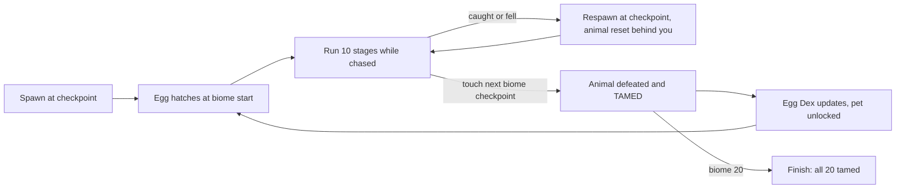
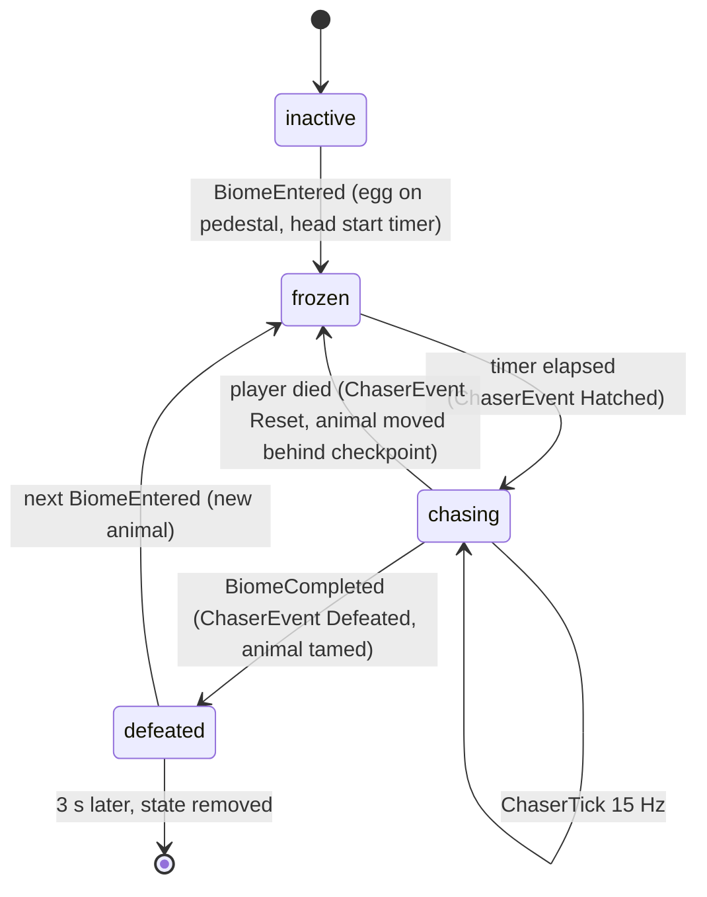
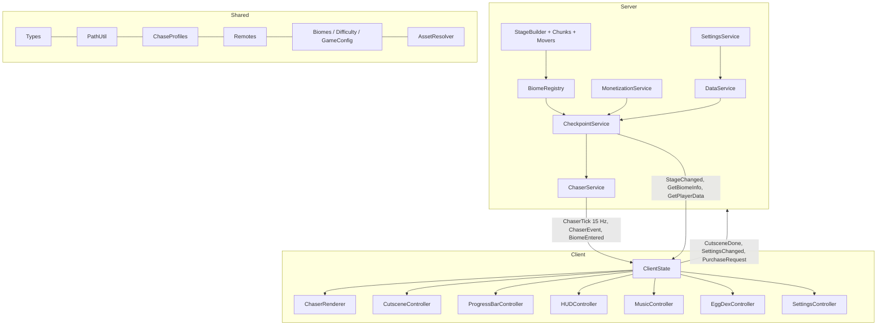

# Hatch & Dash: Game Design Document

A Roblox difficulty-chart obby where every difficulty tier is a biome and every biome hatches an animal that chases you. 20 biomes, 200 stages, 20 eggs, 20 animals to outrun and tame.

_Version 1.0. Source of truth for every number in this document: `docs/roster.json`, `docs/roster_mapping.json` and the generated `Biomes.luau`. Rebuild with `scripts/build_gdd.py`._

## 1. Vision and Pitch

**Hatch & Dash** (working title). Tagline: *Crack the egg. Beat the biome. Don't get caught.*

**One sentence.** A Roblox difficulty-chart obby where every difficulty tier is its own biome, and every biome starts with an egg that hatches the animal that will chase you through all ten of its stages.

**The pitch.** Players know exactly what a difficulty chart obby is: 200 stages, tiers from Easy to Nil, one checkpoint per stage, bragging rights for how far you got. We keep every one of those expectations and add the thing Roblox is obsessed with right now: eggs and animals. Each of the 20 tiers is a hand-themed biome (a sunny meadow, a rooftop at sunset, a megalodon trench, a dragon's peak) and each biome has one animal, from the 140-model Animal Empire bundle, that hatches from an egg on a pedestal in a five-second cutscene and then runs the obby behind you. A bar across the top of the screen shows the whole biome, your headshot, and a live render of the animal creeping up on you. Reach the next biome's checkpoint and the animal is defeated and **tamed**: it joins your Egg Dex and can follow you as a pet. Twenty eggs, twenty animals, one run.

| | |
|---|---|
| Genre | Obby / platformer with a pursuit layer, single-player progression in a multiplayer server |
| Platform | Roblox: PC, mobile (thumbstick + jump only), tablet, console-friendly |
| Audience | 9-14 core, the difficulty-chart-obby crowd plus the pet and egg crowd; secondary: obby YouTubers |
| Session length | 8-15 minutes casual, 30-60 minutes for a push through a biome |
| Rating | All ages; no blood, no jumpscares, animals are chasers not horrors |
| Team | 3-4 people (design, build, script, art), see section 9 |

**The twist, as told to a 10-year-old.** "It's a difficulty chart obby, but every level is a different world, and at the start of each world there's an egg. It hatches, an animal jumps out, and it chases you the whole world. If it catches you, you go back to your checkpoint and it gets pushed back too. Beat the world and you tame it."

### 1.1 Design pillars

1. **The egg is the hook.** Every biome opens on a hatch. The reveal is the emotional beat, so it gets the camera, the sound, and the tier card. *We will* make the first hatch of each biome mandatory and spectacular. *We will not* let it become tedious: repeats are skippable.
2. **Fair pressure, never cheap deaths.** The animal punishes stalling, not skill. *We will* rubber-band it so a player who keeps moving is never caught from behind. *We will not* let it out-run a clean run, ever; the only way to get caught is to stop.
3. **Difficulty comes from the biome number.** Stage layouts, hazards and animal speed all scale with the tier. *We will* introduce exactly one new mechanic per biome and stack it on the old ones. *We will not* introduce two new ideas in one biome.
4. **Long stages, honest checkpoints.** *We will* make stages 200-430 studs of path with a checkpoint at every stage, so a death costs seconds. *We will not* build blind drops, cheese routes or checkpoint-less gauntlets.
5. **Collect the roster.** The animal that chased you becomes yours. *We will* build the Egg Dex, the tamed-pet follower and seasonal biomes from the leftover animals. *We will not* sell power over other players; skips and coils only ever move you along your own run.

### 1.2 Core loop



### 1.3 What the player experiences

- **Minute 1.** Spawn on Sunny Meadow's first checkpoint. Camera swings to a polka-dot egg; it wobbles, cracks, a Capybara pops out and the card reads BIOME 1 - EASY - SUNNY MEADOW. "RUN!" The bar at the top shows a capybara icon 24 studs behind your face. You jump three stepping stones and look back: it is strolling. Relief, then a grin.
- **Minute 5.** Biome 2, Golden Farm. The Golden Retriever is faster and the hay carts move. You stall on a cart, the dog icon slides toward yours, the bar's animal marker starts pulsing red and a heartbeat fades in. You make it. Checkpoint toast.
- **Minute 30.** Biome 5 or 6. You have tamed four animals; the Egg Dex shows four gold cells. The Kangaroo bounces you around Red Outback on bounce pads; you get caught twice and see the CAUGHT! flash, but every death only costs a few seconds. You look at the Shop once and close it.
- **Hour 5.** Biome 14, Pterosaur Peaks. You know the rhythm: hatch, sprint the first three stages while the animal is frozen, settle into the pace, never stop on a wind platform. A friend joins and you watch their Quetzalcoatlus chase them on their own bar. You are playing for the Egg Dex now, and for biome 20's dragon.

### 1.4 Why now

Market research (September 2026) points the same way from three directions:

- **Eggs and animals are the platform's dominant loop.** Steal An Egg is the number one experience on Roblox; Grow a Garden built its retention on eggs that sit in the world with a visible timer; Adopt Me and Pet Simulator 99 proved players are protective of hatch feel and that a journal of hatched creatures gives completionists a long tail.
- **Chase obbies are a proven, under-produced genre.** Barry's Prison Run, Piggy, Rainbow Friends and Doors show that a named, characterful chaser and a cutscene at every checkpoint turn an obby into a story, and that death is the monetisation moment (revive products). Existing animal-escape obbies (Escape Mad Beasts, Escape Zoo) show real demand with thin production values.
- **Difficulty chart obbies are a known quantity with a community**, wikis and conventions (tier names and colours, one checkpoint per stage, skip-stage products). 200 stages in 20 tiers is squarely inside the norm.

### 1.5 Success metrics (targets to validate in soft launch)

| Metric | Target | Why |
|---|---|---|
| D1 retention | 40% | GameAnalytics 2025 places a well-optimised obby above 40% |
| D7 retention | 15% | Egg Dex and tamed pets should hold a week |
| Average session | 12 min | Two biomes of progress for a mid-skill player |
| Biome 1 completion | 80% of new players | The onboarding biome must not lose people |
| Biome 5 completion | 35% of new players | End of act 1 is the first real wall |
| Payer conversion | 3% | Skip stage and revive at death are the two impulse buys |
| ARPDAU | 25-40 Robux | Consistent with front-page obbies of this size |
| Hatch cutscene skip rate (repeats) | under 60% | If higher the cutscene is too long |

## 2. Core Gameplay and Rules

### 2.1 Movement

Default Roblox movement: walkspeed 16 studs/s, jump power 50, no sprint, no double jump. Mobile plays with the thumbstick and the jump button only; every obstacle in the game must be clearable with those two inputs. Speed Coil (walkspeed 24) and Gravity Coil (jump power 65) are gamepasses that make the player's own run easier and are never required.

### 2.2 Stages and checkpoints

- 200 stages, 10 per biome, 20 biomes. Stage N belongs to biome ceil(N / 10). Stage 201 means finished.
- Every stage starts with a Checkpoint pad in the biome's tier colour with a flag and the stage number floating above it.
- Checkpoints are accepted **strictly in order**: touching checkpoint K only counts when your stage is K - 1. Touching an earlier checkpoint does nothing. This kills every skip exploit that does not involve teleporting.
- Respawn is at your checkpoint, 4 studs up, facing along the path. Respawn time is 1.5 s.
- Falling below the world (200 studs under the lowest biome) or touching any kill part respawns you; deaths are counted on your profile.

### 2.3 The chase, in player terms

An egg sits on a pedestal 24 studs before every biome's first checkpoint. When you enter the biome it hatches, and the animal starts running the same route you do, always behind you, always closing when you stop. The bar at the top of the screen is the whole biome: your headshot and the animal's face move along it, and the number under them is the distance in studs. If the animal reaches you, you die and respawn at your checkpoint; the animal is pushed back behind the checkpoint and frozen for a few seconds so you get a fresh start. Reach the next biome's first checkpoint and the animal is defeated and tamed.

### 2.4 The chase, in exact rules

The animal is a number: **s**, studs travelled along the biome's path (a polyline of waypoints through all ten stages). The player is projected onto the same path every frame: **sp**. Everything else follows:

| Rule | Value |
|---|---|
| Chaser speed each frame | `baseSpeed x profileMultiplier x rubberBand` studs/s (biome values below) |
| Catch | `sp - s <= catchDistance` (3 studs) **and** 3D distance from the animal's path point to the player <= `catchRadius` (6 studs), **or** the along-path condition held for 1.0 s continuously (the player is hiding beside the path) |
| On catch | player health set to 0, CAUGHT! flash, death counted |
| On any death | chaser moves to `checkpointS - resetGap`, freezes for `respawnTime + respawnHeadStart` |
| On hatch | chaser frozen for `cutscene (5.2 s) + headStart`; skipping the cutscene starts the head start immediately |
| Never overshoots | `s` is capped at `sp`; the animal cannot pass you and wait ahead |
| Invulnerable | 3 s after a paid Revive Here: no catch, no kill bricks |
| Tick | the server sends `(s, mode)` to the owning player 15 times a second on an unreliable remote |

**Rubber band (fairness).** Applied to the speed every frame:

- **Catch-up.** If the gap `sp - s` is larger than `maxGap`, speed is multiplied by `catchUpMultiplier`. The animal never falls hopelessly behind; the bar always shows it coming.
- **Mercy.** If the gap is smaller than `mercyGap` **and** the player's smoothed forward progress is at least 4 studs/s, speed becomes `min(speed x mercyMultiplier, playerProgress x 0.9)`. A player who keeps moving is never caught from behind, in any biome.
- **Standing still is always punished.** Idle (moving under 2 studs/s) disables mercy, and the `stalker` profile accelerates the animal the longer you idle.

| Value | Biome 1 | Biome 10 | Biome 20 |
|---|---|---|---|
| baseSpeed | 9 studs/s | 15 | 20 |
| headStart after hatch | 12 s | 9 s | 12 s |
| respawnHeadStart | 4.0 s | 3.3 s | 2.5 s |
| resetGap | 45 studs | 38 | 30 |
| maxGap (catch-up beyond) | 200 studs | 172 | 140 |
| catchUpMultiplier | 1.5x | 1.64x | 1.8x |
| mercyGap (mercy inside) | 30 studs | 24 | 18 |
| mercyMultiplier | 0.80x | 0.85x | 0.90x |
| catchDistance / catchRadius | 3 / 6 | 3 / 6 | 3 / 6 |

Player walkspeed is 16 studs/s but real progress along an obby path is 10-12 studs/s in early biomes and 6-8 in late ones. Animal cruise speed climbs 9 -> 20 across the 20 biomes; every animal at or above 13 studs/s has a built-in pause (bursty rest, roar, selfie, slam) so its effective pace stays below a clean run, and the server rubber band guarantees two things: an animal more than maxGap studs behind speeds up (tension never dies), and an animal within mercyGap of a player who keeps progressing is capped just under that player pace (nobody is caught from behind while playing well). Standing still is the only thing that gets you caught; head starts fall from 12 s to 9 s in the middle of the game and rise again late so the harder biomes stay fair.

### 2.5 The seven chase profiles

Each animal has one profile; the profile shapes the speed over time and what the player sees. Profile parameters live in `Biomes.luau`.

| Profile | Feel | Rule | Used by |
|---|---|---|---|
| `steady` | Relentless cruise | multiplier 1 | Capybara, Mammoth |
| `bursty` | Burst and rest | `burstMultiplier` for `burstSeconds`, then `restMultiplier` for `restSeconds` (rest 0.05 = a visible stop: bone sniff, selfie, hide in a bush, tentacle slam) | Golden Retriever, Tanuki, Quokka, Kangaroo, Cerberus, Kraken, Phoenix |
| `stalker` | Idle punisher | 1 + min(idle, idleCap) x idleGain; the longer you stand still, the faster it comes | Cat, Honey Badger, Crocodile |
| `roarer` | Roar then sprint | every `roarEvery` s: stops for `roarSeconds` (telegraph), then `sprintMultiplier` for `sprintSeconds` | Cassowary, Gorilla, Minotaur, Dragon |
| `blinker` | Pounce | cruises at `baseMultiplier`, then teleports `blinkStuds` forward every `blinkPeriod` s with a `telegraphSeconds` warning | Sabre-toothed Tiger |
| `flyer` | Follows the path in the air | multiplier 1; rendered `hoverHeight` above the path with a sine bob | Quetzalcoatlus |
| `swimmer` | Follows the path in the water | multiplier 1; rendered 2 studs below path height with a slow bob | Shark, Megalodon |

Telegraphs are visible: a roaring or about-to-pounce animal pulses with a red highlight, and the bar's animal marker pulses red whenever the gap is under 40 studs, with a heartbeat sound whose volume follows the gap.

### 2.6 Biome transitions, finishing, rejoining

- Touching the next biome's first checkpoint fires **BiomeCompleted** for the old biome (animal plays its defeated fall, TAMED! flash, Egg Dex updates, best time recorded) and **BiomeEntered** for the new one (new egg, new cutscene, new chaser). Both happen in the same frame; the old animal lingers for 3 s.
- Biome 20 ends on a Finish gate after stage 200; touching it sets stage 201, defeats the dragon, awards the Finished badge. The player can keep playing any biome from the Egg Dex (roadmap: teleport to biome).
- Rejoining mid-biome: you spawn at your checkpoint, the biome's egg hatches again (skippable, since you have seen it), and the animal starts one `resetGap` behind your checkpoint instead of at the egg.
- Leaving a biome by any skip product moves the animal with you: the new biome's chaser is created fresh.

### 2.7 Multiplayer rules

- Servers hold 12 players. Every player has their **own** animal; you only ever see your own chaser. Other players are visible and harmless (no collision with you, no PvP), so a server feels alive and friends can race the same biome side by side.
- Roadmap: ghost renders of friends' chasers at low tick rate, and a "spectate a friend's bar" widget.

### 2.8 Death causes

| Cause | What happens |
|---|---|
| Kill part (red neon, tag `KillBrick`) | instant death |
| Fall | destroyed at 200 studs below the lowest biome floor |
| Caught | instant death, CAUGHT! flash, camera shake |
| Reset (Roblox `R`) | same as any death |

### 2.9 Chaser state machine



## 3. The 20 Biomes

**The arc.** Act 1, Pets (1-5): cute animals in daylight pastels teach jumping, movers, kill bricks, spinners and conveyors. Act 2, Wild (6-10): real animals kids already fear, in outback, mines, jungle, temple and reef; bounce pads, wall hops, trusses, crumbling floors and narrow beams. Act 3, Ancient (11-15): caverns, ice age, tar pits, pterosaur peaks and the megalodon trench; darkness, ice, sinking platforms, wind and crushers. Act 4, Myth (16-20): labyrinth, inferno, storm sea, phoenix peak and the dragon finale; portals, rising lava, rotating bars, updraft fans and fire-beam grids stacked on everything before.

**Master roster.** Model names are the exact names in the Animal Empire bundle (including the bundle's own spellings: GoldenRetriver, Mamoth).

| # | Tier | Biome | Animal (folder) | Moves | Chase profile | Speed | Head start | New mechanic | Egg |
|---|---|---|---|---|---|---|---|---|---|
| 1 | Easy | Sunny Meadow | Capybara (BaseAnimals) | ground | steady cruise | 9 st/s | 12 s | Gap jumps (`gapJump`) | Cream hen-style egg with brown speckles sitting in a straw n |
| 2 | Medium | Golden Farm | GoldenRetriver (BaseAnimals) | ground | burst and rest | 10 st/s | 11 s | Moving platforms (`movingPlatform`) | Straw-yellow egg with brown speckles and a green ribbon sitt |
| 3 | Hard | Sunset Rooftops | Cat (BaseAnimals) | ground | idle punisher | 11 st/s | 10 s | Kill-brick lanes (`killLane`) | Grey egg wrapped in red yarn with a tiny bell |
| 4 | Difficult | Whispering Woods | Tanuki (Animal) | ground | burst and rest | 11.5 st/s | 10 s | Spinners (`spinner`) | Mossy green egg with a leaf pattern and an acorn cap on top, |
| 5 | Challenging | Sunset Shore | Quokka (Animal) | ground | burst and rest | 12 st/s | 10 s | Conveyors (`conveyor`) | Sandy beige egg covered in seashell and starfish stickers, s |
| 6 | Intense | Red Outback | Kangaroo (BaseAnimals) | ground | burst and rest | 13 st/s | 9 s | Bounce pads (`bouncePad`) | Large dark green-blue egg with a leathery sheen half-buried  |
| 7 | Remorseless | Honey Mines | HoneyBadger (Animal) | ground | idle punisher | 13.5 st/s | 9 s | Wall hops (`wallHop`) | Amber honey egg with hexagon pattern and dripping golden str |
| 8 | Insane | Emerald Jungle | Cassowary (Animal) | ground | roar then sprint | 14 st/s | 9 s | Truss climbs (`trussClimb`) | Emerald egg with an electric-blue neck-stripe pattern wrappe |
| 9 | Extreme | Ape Temple | Gorilla (BaseAnimals) | ground | roar then sprint | 14.5 st/s | 9 s | Falling floors (`fallingFloor`) | Dark stone-grey egg carved with gold glyphs and moss, half s |
| 10 | Terrifying | Shark Reef | Shark (BaseAnimals) | swimming | swimmer | 15 st/s | 9 s | Narrow beams (`narrowBeam`) | Pearl-white egg nestled inside an open clam shell |
| 11 | Catastrophic | Croc Caverns | Crocodile (BaseAnimals) | ground | idle punisher | 15 st/s | 9 s | Dark corridors (`darkCorridor`) | Dark-green scaled egg with a glowing yellow eye-slit that bl |
| 12 | Horrific | Glacier Age | Mamoth (BaseAnimals) | ground | steady cruise | 15.5 st/s | 9 s | Ice (`icePatch`) | Ice-blue egg sealed inside a block of ice with a mammoth sil |
| 13 | Unreal | Tar Pits | SABER_TOOTHED_TIGER (BaseAnimals) | ground | pounce (teleport) | 16 st/s | 10 s | Sinking platforms (`shrinkingPlatform`) | Tar-black egg with amber sap fossil patterns half sunk in a  |
| 14 | Nil | Pterosaur Peaks | QUETZALCOATLUS (BaseAnimals) | flying | flyer | 16.5 st/s | 10 s | Wind tunnels (`windTunnel`) | Huge grey egg with dark speckles in a nest of bones on a cli |
| 15 | Extinction | The Trench | MEGALODON (BaseAnimals) | swimming | swimmer | 17 st/s | 10 s | Crushers (`crusher`) | Glossy black egg with pulsing electric-blue crack veins, hug |
| 16 | Mythic | The Labyrinth | MINOTAUR (BaseAnimals) | ground | roar then sprint | 17.5 st/s | 11 s | Portal pads (`teleportPad`) | White marble egg with a gold Greek-key band and small bronze |
| 17 | Infernal | Inferno | CERBERUS (BaseAnimals) | ground | burst and rest | 18 st/s | 11 s | Rising lava (`risingLava`) | Obsidian egg wrapped in glowing chains with hellfire cracks |
| 18 | Abyssal | Storm Sea | KRAKEN (BaseAnimals) | swimming | burst and rest | 18.5 st/s | 12 s | Rotating bars (`rotatingBar`) | Deep-purple egg with sucker-dot pattern and one golden eye,  |
| 19 | Celestial | Phoenix Peak | FIREPHOENIX (BaseAnimals) | flying | burst and rest | 19 st/s | 12 s | Updraft fans (`fanLaunch`) | Molten black egg with glowing orange cracks and a flame wisp |
| 20 | Omega | Dragon's End | CLASSICDRAGON (BaseAnimals) | flying | roar then sprint | 20 st/s | 12 s | Beam grids (`laserGrid`) | Giant golden egg with red scales and a crown-like crest sitt |

### 3.0 How to read the biome sheets

Each sheet below gives the builder everything for one biome: theme, animal, the chase feel in engine terms (profile name and the numbers that go into `Biomes.luau`), the mechanic the biome introduces, hazards, egg, palette, music, targets, a thumbnail moment, and alternates if a model turns out to be unusable. Engine values are generated into `Biomes.luau`; the prose is the design intent for the hand-built version of each stage.

### 3.1 Biome 1: Sunny Meadow (Easy)

**Animal:** Capybara from the `BaseAnimals` folder, ground locomotion. **Tier colour:** #75F347.

**Theme.** Rolling green hills, wildflowers, a wooden fence path, a giant friendly sun and steaming hot springs in the distance (capybara-onsen meme). Mood: Sunday morning, nothing can hurt you.

**Why this animal.** The number-one meme animal for this age group. A capybara calmly waddling after you at 9 studs/s is funny instead of scary, so total beginners laugh rather than quit, and the first 30 seconds are already clip-worthy. Reads instantly as a brown blob with a nose at 48 px.

**Chase feel.** Engine profile `steady` (steady cruise), base speed 9 studs/s, head start 12 s, profile params: defaults. Designed behaviour: Slow, unbothered walk along the path. Never sprints. Exists to teach what the bar means and that the animal WILL eventually reach you if you stand still. Twist: Chill mode: it sits down to chew for 2 s at every stage gate it passes (visible on the bar as a stall) - a free breather that teaches checkpoints matter.

**New mechanic (Gap jumps, chunk key `gapJump`).** Basic gap jumps and stepping stones (1-6 stud gaps, single-block steps); falling into water just respawns you at the checkpoint Stages 1-3 introduce it clean, stages 4-7 mix it with every earlier mechanic, stages 8-10 are the mastery test.

**Signature hazards.**
- Short gap jumps over shallow streams
- Stepping-stone chains across a pond
- Hay-bale staircases (vertical intro)
- Low hedges to jump over
- Lily-pad ford at the river (wide, forgiving)

**Egg.** Cream hen-style egg with brown speckles sitting in a straw nest, with a tiny orange-slice sticker on top (capybara-with-yuzu meme). 3 studs tall, soft golden sparkle particles.

**Palette.** #7BC950 grass green (ground), #8ED6FF sky blue (sky/water), #FFD23F sunflower yellow (accents/checkpoints), #8B5A2B capybara brown (fences, hazards)

**Music.** Ukulele lo-fi with bird chirps; laid back, loops without tension

**Targets.** Path length per stage about 200 studs, target clear time 40 s per stage, expected deaths per stage about 0.3, biome time about 7 minutes for a competent player.

**Showpiece moment.** The thumbnail beat for this biome is the Capybara at full speed on the biome's new mechanic: frame the player mid-air over the gap jumps with the animal one body-length behind.

**Alternates if the model does not work out:** none.

### 3.2 Biome 2: Golden Farm (Medium)

**Animal:** GoldenRetriver from the `BaseAnimals` folder, ground locomotion. **Tier colour:** #FFFE00.

**Theme.** Wheat fields at golden hour with a red barn, windmills, tractors and pumpkin patches; a hay-cart railway runs the length of the biome.

**Why this animal.** Still cute and harmless, but bigger and faster than the bunny; it reads as the dog that just wants to play, so escalation is felt without fear. Golden retrievers are one of the most requested pets on the platform.

**Chase feel.** Engine profile `bursty` (burst and rest), base speed 10 studs/s, head start 11 s, profile params: burstSeconds = 9, burstMultiplier = 1.0, restSeconds = 3, restMultiplier = 0.05. Designed behaviour: Trots at a constant 10 studs/s and stops for 3 s at bone props every 12 s. Net pace about 7.5 studs/s. The bone props are visible on the path so players can plan where to catch a breath. Twist: Bone sniff: stops 3 s at visible bone props placed by the level designer, teaching that pauses are tied to world objects.

**New mechanic (Moving platforms, chunk key `movingPlatform`).** Moving platforms: hay carts on rails, windmill-blade lifts and tractor beds that carry you across gaps on fixed loops. Stages 1-3 introduce it clean, stages 4-7 mix it with every earlier mechanic, stages 8-10 are the mastery test.

**Signature hazards.**
- Hay carts on rails (ride and jump)
- Slow windmill blades (push early, kill in later stages)
- Mud slow zones
- Fence hurdles with tighter timing
- Rolling pumpkins down slopes

**Egg.** Straw-yellow egg with brown speckles and a green ribbon sitting in a hay bale; wobbles kick up dust puffs, cracks with a happy bark.

**Palette.** #F4C542 wheat, #C0392B barn red, #6FCF97 crop green, #5DADE2 sky

**Music.** Country banjo and hand claps, 120 BPM

**Targets.** Path length per stage about 210 studs, target clear time 45 s per stage, expected deaths per stage about 0.5, biome time about 8 minutes for a competent player.

**Showpiece moment.** The thumbnail beat for this biome is the GoldenRetriver at full speed on the biome's new mechanic: frame the player mid-air over the moving platforms with the animal one body-length behind.

**Alternates if the model does not work out:** Capybara, Cavalier King Charles Spaniel.

### 3.3 Biome 3: Sunset Rooftops (Hard)

**Animal:** Cat from the `BaseAnimals` folder, ground locomotion. **Tier colour:** #FD7C00.

**Theme.** City rooftops at golden hour: water towers, laundry lines, AC units, neon signs flickering on. You parkour building to building while a cat stalks you along the ledges. Mood: anime opening.

**Why this animal.** Cats are the most-loved animal for kids and a cat calmly stalking you across rooftops is the cat.exe meme. Simple ears-and-tail silhouette at small size, and the 'it only pounces when you stop' twist teaches the core rule of the whole game.

**Chase feel.** Engine profile `stalker` (idle punisher), base speed 11 studs/s, head start 10 s, profile params: idleGain = 0.4, idleCap = 4. Designed behaviour: Walks at a stalking pace, but punishes idling hard. Twist: Idle pounce: if the player stands still for more than 2 s the cat sprints at 18 studs/s until the player moves again (tell: crouch wiggle + hiss).

**New mechanic (Kill-brick lanes, chunk key `killLane`).** Kill bricks (glowing red neon vents and sparking wires: touch = instant respawn at checkpoint) Stages 1-3 introduce it clean, stages 4-7 mix it with every earlier mechanic, stages 8-10 are the mastery test.

**Signature hazards.**
- Sparking AC units (kill bricks) on ledges
- Neon-tube kill strips along walkways
- Clothesline tightropes (narrow beams)
- Fire-escape ladders (light truss climb)
- Billboard moving platforms
- Building-to-building long jumps

**Egg.** Grey egg wrapped in red yarn with a tiny bell; 3 studs, sparkle particles; sits on a rooftop cushion.

**Palette.** #FF7A3D sunset orange (sky), #4B2E83 dusk purple (shadows), #FF2E88 neon pink (kill bricks, signs), #2A2A3A rooftop grey (ground)

**Music.** Lo-fi hip hop with distant city traffic; head-nod tempo

**Targets.** Path length per stage about 220 studs, target clear time 50 s per stage, expected deaths per stage about 0.7, biome time about 8 minutes for a competent player.

**Showpiece moment.** The thumbnail beat for this biome is the Cat at full speed on the biome's new mechanic: frame the player mid-air over the kill-brick lanes with the animal one body-length behind.

**Alternates if the model does not work out:** none.

### 3.4 Biome 4: Whispering Woods (Difficult)

**Animal:** Tanuki from the `Animal` folder, ground locomotion. **Tier colour:** #FF0000.

**Theme.** A dappled autumn forest of giant tree trunks, mushroom platforms, rope bridges and rolling logs with sunbeams through the canopy. First biome with real verticality and shadow.

**Why this animal.** The mischievous raccoon-dog bridges pet to wild: still cute, but it hides in bushes and pops out. Its trickster folklore role justifies introducing the idle punisher without making the game scary yet.

**Chase feel.** Engine profile `bursty` (burst and rest), base speed 11.5 studs/s, head start 10 s, profile params: burstSeconds = 7, burstMultiplier = 1.0, restSeconds = 3, restMultiplier = 0.05. Designed behaviour: Runs at 11 studs/s, then ducks into a bush for 3 s every 10 s (net about 7.7). If the player's progress value has not changed for 2 s it drums its belly (audible cue) and sprints at 15 until they move again. Twist: Idle punisher, introduced here: standing still for 2 s triggers a belly-drum and a 15 studs/s sprint that ends the moment you move.

**New mechanic (Spinners, chunk key `spinner`).** Rotating hazards: spinning log rollers, swinging thorn branches and windmill-style spinners that kill on touch, all on readable fixed timings. Stages 1-3 introduce it clean, stages 4-7 mix it with every earlier mechanic, stages 8-10 are the mastery test.

**Signature hazards.**
- Rolling log spinners
- Swinging thorn branches
- Rope bridges with missing planks
- Harmless mushroom bounce platforms
- Falling acorns on a fixed timer

**Egg.** Mossy green egg with a leaf pattern and an acorn cap on top, tucked between tree roots; fireflies orbit it and it cracks with a drum thump.

**Palette.** #3E7C3A canopy green, #A0522D bark brown, #F2B134 autumn gold, #FFF3C7 sunbeams

**Music.** Marimba, woodblock and flute, playful forest theme, 118 BPM

**Targets.** Path length per stage about 240 studs, target clear time 55 s per stage, expected deaths per stage about 0.9, biome time about 9 minutes for a competent player.

**Showpiece moment.** The thumbnail beat for this biome is the Tanuki at full speed on the biome's new mechanic: frame the player mid-air over the spinners with the animal one body-length behind.

**Alternates if the model does not work out:** Badger, Koala.

### 3.5 Biome 5: Sunset Shore (Challenging)

**Animal:** Quokka from the `Animal` folder, ground locomotion. **Tier colour:** #C00000.

**Theme.** A tropical beach at sunset: tide pools, sandcastles, driftwood piers and palms under an orange sky, with turquoise water constantly pushing across the path.

**Why this animal.** The happiest animal on earth chasing you at full smile is pure comedy, which keeps the early game friendly while speed climbs. It lives on Rottnest Island beaches, so the setting is honest. It is the last purely cute chaser.

**Chase feel.** Engine profile `bursty` (burst and rest), base speed 12 studs/s, head start 10 s, profile params: burstSeconds = 10, burstMultiplier = 1.0, restSeconds = 3, restMultiplier = 0.05. Designed behaviour: Perfectly constant 12 studs/s with a 3 s selfie pose every 10 s (net about 8.4). No tricks, no idle punishment: this is the calibration biome where players learn conveyor timing against a predictable pursuer. Twist: Selfie pose: stops 3 s every 10 s with a camera-shutter sound; otherwise the most predictable chaser in the game by design.

**New mechanic (Conveyors, chunk key `conveyor`).** Conveyors and push currents: tide-pull sand conveyors running with and against you, and rip-current zones that push sideways toward the water. Stages 1-3 introduce it clean, stages 4-7 mix it with every earlier mechanic, stages 8-10 are the mastery test.

**Signature hazards.**
- Tide conveyors (with and against you)
- Rip currents pushing sideways
- Timed crab-claw snap traps in the sand
- Tide rising and falling over pier planks
- Coconut drops from palms

**Egg.** Sandy beige egg covered in seashell and starfish stickers, set in a sandcastle turret; bubbles rise from it and it cracks with a squeak.

**Palette.** #FF8C42 sunset orange, #2EC4B6 shallow water, #F7E1A0 sand, #7B2CBF dusk purple

**Music.** Steel drums and surf guitar, 115 BPM

**Targets.** Path length per stage about 250 studs, target clear time 60 s per stage, expected deaths per stage about 1.1, biome time about 10 minutes for a competent player.

**Showpiece moment.** The thumbnail beat for this biome is the Quokka at full speed on the biome's new mechanic: frame the player mid-air over the conveyors with the animal one body-length behind.

**Alternates if the model does not work out:** Crab, Seal.

### 3.6 Biome 6: Red Outback (Intense)

**Animal:** Kangaroo from the `BaseAnimals` folder, ground locomotion. **Tier colour:** #19222D.

**Theme.** Red-ochre canyons, termite mounds and geyser bounce pads under a huge pale sky. Tumbleweeds roll through and cactus spikes line every landing ledge.

**Why this animal.** A kangaroo bounding after you is the perfect mascot for the jump-pad biome: it is the only chaser that uses the pads, sailing over sections you had to earn, so players feel the mechanic from both sides.

**Chase feel.** Engine profile `bursty` (burst and rest), base speed 13 studs/s, head start 9 s, profile params: burstSeconds = 2, burstMultiplier = 1.4, restSeconds = 1, restMultiplier = 0.3. Designed behaviour: Bounds at 14 studs/s. On reaching a jump pad it is launched over the next section (skipping 20-30 studs) and lands with a 1 s stagger. Averages about 12.5 studs/s on pad-heavy stages. Twist: it uses the jump pads too, skipping whole sections, but staggers for 1 s on every landing

**New mechanic (Bounce pads, chunk key `bouncePad`).** Jump pads (bounce pads that launch the player on a fixed arc; landing accuracy matters) Stages 1-3 introduce it clean, stages 4-7 mix it with every earlier mechanic, stages 8-10 are the mastery test.

**Signature hazards.**
- Jump-pad chains across canyon gaps
- Cactus kill-brick landing zones
- Rolling tumbleweed kill rollers
- Conveyor sand-slides that feed into pad launches
- Truss climbs up termite mounds

**Egg.** Large dark green-blue egg with a leathery sheen half-buried in red sand; dust-puff particles.

**Palette.** #C1440E red ochre (ground/cliffs), #E5C07B sand (platforms), #CFE8F3 pale sky (backdrop), #7A9D54 cactus green (hazards)

**Music.** Didgeridoo drone with clapsticks and slide guitar at 100 BPM

**Targets.** Path length per stage about 260 studs, target clear time 65 s per stage, expected deaths per stage about 1.3, biome time about 11 minutes for a competent player.

**Showpiece moment.** The thumbnail beat for this biome is the Kangaroo at full speed on the biome's new mechanic: frame the player mid-air over the bounce pads with the animal one body-length behind.

**Alternates if the model does not work out:** Emu, Cassowary.

### 3.7 Biome 7: Honey Mines (Remorseless)

**Animal:** HoneyBadger from the `Animal` folder, ground locomotion. **Tier colour:** #C800C8.

**Theme.** A mine dug into a colossal beehive: honeycomb walls, dripping honey, mine-cart rails, lantern light and huge decorative bees. Mood: golden, sticky, industrial. The beast act begins.

**Why this animal.** 'Honey badger don't care' is still quoted by kids. It is the first animal that feels relentless - no pauses, no gimmicks - which is exactly the tone shift from meme act to beast act. Black-and-white face is high contrast on the bar.

**Chase feel.** Engine profile `stalker` (idle punisher), base speed 13.5 studs/s, head start 9 s, profile params: idleGain = 0.5, idleCap = 4. Designed behaviour: Never pauses, never idles, constant pace. The first biome where the stall budget is real. Twist: Doesn't care: it smashes straight through honeycomb barriers the player must walk around (its path spline is 10 percent shorter). On catch it does a shrug animation.

**New mechanic (Wall hops, chunk key `wallHop`).** Wall hops: staggered mine-shaft ledges you leap between while climbing out of the pit (the first vertical biome). Stages 1-3 introduce it clean, stages 4-7 mix it with every earlier mechanic, stages 8-10 are the mastery test.

**Signature hazards.**
- Rotating honey-dipper kill bars
- Honey slow patches (walkspeed 10)
- Mine-cart moving platforms on rails
- Timed dripping-honey kill drops
- Crumbly honeycomb ledges
- Lantern-lit rail beams over drops

**Egg.** Amber honey egg with hexagon pattern and dripping golden stripes; 4 studs, slow honey-drip particles.

**Palette.** #F2A900 honey gold (accents, platforms), #3B2A14 mine dark (walls), #FFE08A comb light (guides), #1A1A1A badger black (kill bars)

**Music.** Bass-heavy funk with industrial clanks and bee buzz

**Targets.** Path length per stage about 270 studs, target clear time 70 s per stage, expected deaths per stage about 1.5, biome time about 12 minutes for a competent player.

**Showpiece moment.** The thumbnail beat for this biome is the HoneyBadger at full speed on the biome's new mechanic: frame the player mid-air over the wall hops with the animal one body-length behind.

**Alternates if the model does not work out:** none.

### 3.8 Biome 8: Emerald Jungle (Insane)

**Animal:** Cassowary from the `Animal` folder, ground locomotion. **Tier colour:** #0000FF.

**Theme.** Dense rainforest: giant kapok trees, waterfalls, hanging vines and ruined stone steps swallowed by moss, humid mist and neon frogs. Stages go vertical for the first time.

**Why this animal.** The world's most dangerous bird, native to rainforest, with a dinosaur look that foreshadows the prehistoric act. Its charge is telegraphed and its inability to climb makes verticality a real defense.

**Chase feel.** Engine profile `roarer` (roar then sprint), base speed 14 studs/s, head start 9 s, profile params: roarEvery = 8, roarSeconds = 1.0, sprintMultiplier = 1.7, sprintSeconds = 2. Designed behaviour: 12 s cycle: 5 s at 15, a 1.5 s head-down charge at 21, then 5.5 s of feather shaking. Net about 9 studs/s. While the player is on a truss the Cassowary waits at the base, so fast climbing buys time. Twist: Cannot climb: it stalls at the foot of every truss until the player leaves it, so the new mechanic is also the counterplay.

**New mechanic (Truss climbs, chunk key `trussClimb`).** Climbing: trusses, vines and ladders, with the first vertical stages (climb, jump, climb). Stages 1-3 introduce it clean, stages 4-7 mix it with every earlier mechanic, stages 8-10 are the mastery test.

**Signature hazards.**
- Vine trusses over waterfalls
- Rotten log bridges
- Poison-dart plant spitters (timed projectiles across the path)
- Waterfall push zones
- Carnivorous plant snap platforms
- Rolling boulders on stone stairs

**Egg.** Emerald egg with an electric-blue neck-stripe pattern wrapped in vines among glowing mushrooms; it cracks with a low boom.

**Palette.** #0B6E4F deep green, #A7F432 neon leaf, #3D2B1F wet bark, #00B4D8 waterfall

**Music.** Tribal drums, pan flute and jungle ambience, 128 BPM

**Targets.** Path length per stage about 280 studs, target clear time 75 s per stage, expected deaths per stage about 1.7, biome time about 12 minutes for a competent player.

**Showpiece moment.** The thumbnail beat for this biome is the Cassowary at full speed on the biome's new mechanic: frame the player mid-air over the truss climbs with the animal one body-length behind.

**Alternates if the model does not work out:** Fossa, HoneyBadger.

### 3.9 Biome 9: Ape Temple (Extreme)

**Animal:** Gorilla from the `BaseAnimals` folder, ground locomotion. **Tier colour:** #0389FF.

**Theme.** A crumbling, mossy stone temple in the canopy, giant ape statues, collapsing bridges and echoing drums. Mood: first true boss fight.

**Why this animal.** '100 men vs 1 gorilla' is the meme of the year. A gorilla that beats its chest and charges is the perfect first boss and thumbnail, and its blocky black shape reads well at any size.

**Chase feel.** Engine profile `roarer` (roar then sprint), base speed 14.5 studs/s, head start 9 s, profile params: roarEvery = 10, roarSeconds = 1.5, sprintMultiplier = 1.6, sprintSeconds = 3. Designed behaviour: Steady walk, then a 1.5 s chest-beat (tell) followed by a 2 s charge at 19 studs/s. Twist: Ground pound: at every stage gate it passes it pounds the ground, sending a visible shockwave ring 25 studs along the path; if you are grounded when it reaches you, you are shoved 3 studs (into hazards) - jump over it.

**New mechanic (Falling floors, chunk key `fallingFloor`).** Crumbling platforms (collapse 0.5 s after landing and do NOT return until you respawn - route commitment) Stages 1-3 introduce it clean, stages 4-7 mix it with every earlier mechanic, stages 8-10 are the mastery test.

**Signature hazards.**
- Crumbling stone bridges
- Shockwave rings to jump over
- Swinging spiked logs (spinner variant)
- Crumbling pillars combined with moving platforms
- Timed dart-trap kill bricks
- Collapsing stairways under the gorilla's charge

**Egg.** Dark stone-grey egg carved with gold glyphs and moss, half sunk in a temple altar; 4.5 studs, dust and gold-glint particles.

**Palette.** #4A6A4A mossy stone (ground), #2B2B2B gorilla black (hazards), #D4AF37 temple gold (checkpoints), #7FB069 jungle light (background)

**Music.** Heavy taiko drums with choir stabs, boss-fight tempo

**Targets.** Path length per stage about 300 studs, target clear time 80 s per stage, expected deaths per stage about 1.9, biome time about 13 minutes for a competent player.

**Showpiece moment.** The thumbnail beat for this biome is the Gorilla at full speed on the biome's new mechanic: frame the player mid-air over the falling floors with the animal one body-length behind.

**Alternates if the model does not work out:** none.

### 3.10 Biome 10: Shark Reef (Terrifying)

**Animal:** Shark from the `BaseAnimals` folder, swimming locomotion. **Tier colour:** #00FFFF.

**Theme.** A bright coral reef with a sunken pirate ship, kelp forests and sun rays through water. The entire biome is underwater with air-bubble stations. Mood: Jaws in candy colours.

**Why this animal.** 'SHARK' is the most primal chase animal there is. Introducing swimming with a fin closing in behind you is instantly readable, the grey fin silhouette is iconic on the bar, and it sets up the Megalodon callback at biome 14 ('the shark was nothing').

**Chase feel.** Engine profile `swimmer` (swimmer), base speed 15 studs/s, head start 9 s, profile params: defaults. Designed behaviour: Smooth, constant swim along the path; the water at the screen edge tints red as it closes. Twist: Fin tell: within 30 studs the 'dun-dun' sting plays. It circles for 3 s at every air-bubble station it passes (mercy so you can breathe).

**New mechanic (Narrow beams, chunk key `narrowBeam`).** Narrow coral beams over open water: one-stud-wide reef bridges where the water below is the kill zone and the shark circles right under you. (Hand-built upgrade: real Terrain water stretches with an air meter.) Stages 1-3 introduce it clean, stages 4-7 mix it with every earlier mechanic, stages 8-10 are the mastery test.

**Signature hazards.**
- Oxygen timer between bubble stations
- Drifting jellyfish kill bricks
- Sea-urchin kill patches
- Closing giant clams (crushers preview)
- Swinging anchor spinners
- Kelp thickets that hide gaps

**Egg.** Pearl-white egg nestled inside an open clam shell; 4 studs, bubble particles.

**Palette.** #1E90FF ocean blue (water), #FF6F61 coral (platforms), #7CFFCB sea foam (bubble stations / checkpoints), #5C6B73 shark grey (hazards)

**Music.** Muffled synth-wave with a rising heartbeat and Jaws-style two-note sting

**Targets.** Path length per stage about 310 studs, target clear time 85 s per stage, expected deaths per stage about 2.1, biome time about 14 minutes for a competent player.

**Showpiece moment.** The thumbnail beat for this biome is the Shark at full speed on the biome's new mechanic: frame the player mid-air over the narrow beams with the animal one body-length behind.

**Alternates if the model does not work out:** none.

### 3.11 Biome 11: Croc Caverns (Catastrophic)

**Animal:** Crocodile from the `BaseAnimals` folder, ground locomotion. **Tier colour:** #FFFFFF.

**Theme.** A flooded, pitch-black cave system lit only by glowing mushrooms and your lantern; half swim, half rock climb, bones on every shore. Mood: horror.

**Why this animal.** The 'crocodile in the sewers / caves' urban legend. Croc jaws are the most recognisable bite silhouette, and a chaser that is slow on land but terrifying in water forces kids to route-plan for the first time.

**Chase feel.** Engine profile `stalker` (idle punisher), base speed 15 studs/s, head start 9 s, profile params: idleGain = 0.6, idleCap = 3. Designed behaviour: Lumbers on land, rockets in water (needs swim animation for the water sections). In the dark you only see its two glowing eyes and the bar icon. Twist: 18 studs/s in water; death-roll lunge at 24 studs/s for 1 s when within 15 studs in water (tell: ripple ring).

**New mechanic (Dark corridors, chunk key `darkCorridor`).** Darkness / limited vision (lantern radius; some platforms only appear when lit, glow crystals mark the route) Stages 1-3 introduce it clean, stages 4-7 mix it with every earlier mechanic, stages 8-10 are the mastery test.

**Signature hazards.**
- Hidden gaps outside the lantern radius
- Falling stalactite kill drops
- Underwater tunnels with oxygen
- Sinking bone-raft platforms
- Slippery wet rock (ice-lite)
- Rotating cave-drill spinners

**Egg.** Dark-green scaled egg with a glowing yellow eye-slit that blinks; 4.5 studs, green glow particles.

**Palette.** #0B0F0D cave black (background), #2E8B57 croc green (hazards), #7DF9FF glow-mushroom cyan (guides / checkpoints), #C7B299 bone (platforms)

**Music.** Dripping water, low drones, sudden stings when the eyes appear

**Targets.** Path length per stage about 320 studs, target clear time 85 s per stage, expected deaths per stage about 2.2, biome time about 14 minutes for a competent player.

**Showpiece moment.** The thumbnail beat for this biome is the Crocodile at full speed on the biome's new mechanic: frame the player mid-air over the dark corridors with the animal one body-length behind.

**Alternates if the model does not work out:** none.

### 3.12 Biome 12: Glacier Age (Horrific)

**Animal:** Mamoth from the `BaseAnimals` folder, ground locomotion. **Tier colour:** #9695FF.

**Theme.** Ice-age wasteland at night: blue glaciers, blizzard gusts, frozen waterfalls and an aurora overhead; ice pillars shatter behind you as the mammoth plows through. Everything is slippery.

**Why this animal.** The one chaser that never stops. Its slow, relentless pace is a horror beat (the Terminator effect): its bar icon never pauses, and the visible destruction of ice pillars behind you sells its mass. Its low nominal speed is deliberate; it has the highest effective average in the game so far.

**Chase feel.** Engine profile `steady` (steady cruise), base speed 15.5 studs/s, head start 9 s, profile params: defaults. Designed behaviour: Constant 10.5 studs/s with no pauses, no bursts and no baiting; it ramps from 0 to 10.5 over 3 s after any reset and then never slows. Because the player slides and waits on ice, 10.5 unbroken is a tighter margin than any burst chaser before it. Twist: Unstoppable: zero pause cycle. Ice pillars along the path shatter as it passes, a physical timer of how close it is.

**New mechanic (Ice, chunk key `icePatch`).** Ice and low friction: sliding momentum, slope slides and ice-ramp jumps that require pre-turning. Stages 1-3 introduce it clean, stages 4-7 mix it with every earlier mechanic, stages 8-10 are the mastery test.

**Signature hazards.**
- Ice floors with slide momentum
- Blizzard gusts that push
- Frozen waterfall climbs with breakaway icicles
- Cracking ice over freezing water
- Snowball rollers on slopes
- Icicle drops on a timer

**Egg.** Ice-blue egg sealed inside a block of ice with a mammoth silhouette frozen inside; snow flurries, and the ice shatters with a trumpet blast.

**Palette.** #A8DADC glacier blue, #1D3557 night navy, #F1FAEE snow, #7FFFD4 aurora

**Music.** Cold synth pads and a slow tribal drum that never stops, 85 BPM

**Targets.** Path length per stage about 330 studs, target clear time 90 s per stage, expected deaths per stage about 2.4, biome time about 15 minutes for a competent player.

**Showpiece moment.** The thumbnail beat for this biome is the Mamoth at full speed on the biome's new mechanic: frame the player mid-air over the ice with the animal one body-length behind.

**Alternates if the model does not work out:** Polar Bear, Yak.

### 3.13 Biome 13: Tar Pits (Unreal)

**Animal:** SABER_TOOTHED_TIGER from the `BaseAnimals` folder, ground locomotion. **Tier colour:** #630091.

**Theme.** A prehistoric night: bubbling black tar pools, amber sap, mammoth bones and fern silhouettes under a huge moon; platforms sink when you stand on them. First prehistoric biome.

**Why this animal.** The iconic La Brea predator is the perfect prehistoric opener: it stalks like a cat, so for the first time the chase is distance-based rather than time-based.

**Chase feel.** Engine profile `blinker` (pounce (teleport)), base speed 16 studs/s, head start 10 s, profile params: blinkStuds = 20, blinkPeriod = 7, baseMultiplier = 0.8, telegraphSeconds = 0.8. Designed behaviour: Creeps at 16.5 studs/s while more than 30 studs behind. At 30 studs it crouches for 4 s (growl, eye glint on the bar icon), pounces at 26 for 1.5 s, then recovers 1.5 s. Net about 10 studs/s when engaged; freezing on a sinking platform is doubly punished. Twist: Stalk and pounce: the only chaser that changes behaviour by distance, so the bar's gap number becomes a warning meter.

**New mechanic (Sinking platforms, chunk key `shrinkingPlatform`).** Sinking and crumbling platforms: platforms that sink into tar or crumble 0.8 s after you land, forcing continuous movement. Stages 1-3 introduce it clean, stages 4-7 mix it with every earlier mechanic, stages 8-10 are the mastery test.

**Signature hazards.**
- Sinking tar platforms
- Bone bridges that crumble
- Amber sap slow zones
- Tar bubbles that burst upward (kill)
- Fern spinners

**Egg.** Tar-black egg with amber sap fossil patterns half sunk in a tar pool ringed by bones; it cracks with a snarl and the tar around it drains away.

**Palette.** #0A0A0A tar, #FFB627 amber, #E8DCC4 bone, #2E4057 night blue

**Music.** Low strings and bone percussion, 95 BPM, heartbeat rises when the tiger crouches

**Targets.** Path length per stage about 350 studs, target clear time 95 s per stage, expected deaths per stage about 2.6, biome time about 16 minutes for a competent player.

**Showpiece moment.** The thumbnail beat for this biome is the SABER_TOOTHED_TIGER at full speed on the biome's new mechanic: frame the player mid-air over the sinking platforms with the animal one body-length behind.

**Alternates if the model does not work out:** DIMETRODON, STEGOSAURUS.

### 3.14 Biome 14: Pterosaur Peaks (Nil)

**Animal:** QUETZALCOATLUS from the `BaseAnimals` folder, flying locomotion. **Tier colour:** #65666D.

**Theme.** Storm-lashed cliff spires above the clouds: bone nests, rope-and-bone bridges, lightning strikes and gusts that shove you off ledges. The path is mostly narrow ridges with nothing below.

**Why this animal.** The largest flying animal ever, giraffe-tall with a 10 m wingspan. Its shadow passing over the player is a free telegraph and it fully justifies flying locomotion in a sky biome.

**Chase feel.** Engine profile `flyer` (flyer), base speed 16.5 studs/s, head start 10 s, profile params: hoverHeight = 10, bobAmplitude = 2. Designed behaviour: 8 s cycle: glides at 17.5 for 2.5 s, dives at 24 for 1.5 s toward the player's current position (telegraphed by its shadow crossing them), then hovers 4 s. Net about 10 studs/s. Wind zones push it exactly as they push the player. Twist: Shadow dive: the warning is a shadow decal on the ground, so players learn to watch the floor as well as the bar.

**New mechanic (Wind tunnels, chunk key `windTunnel`).** Wind zones: gusts and updrafts that push, lift or drop you on visible timers, with cloth flags as indicators. Stages 1-3 introduce it clean, stages 4-7 mix it with every earlier mechanic, stages 8-10 are the mastery test.

**Signature hazards.**
- Cross-wind ridges
- Updraft columns you must ride
- Lightning strikes on marked rocks
- Swinging bone bridges
- Cloud platforms that dissolve
- Egg-nest spikes

**Egg.** Huge grey egg with dark speckles in a nest of bones on a cliff edge; lightning flickers across it and it cracks with a thunderclap.

**Palette.** #4A5568 storm grey, #E2E8F0 cloud white, #F6E05E lightning, #2D3748 cliff

**Music.** Orchestral strings with wind howl and thunder hits, 110 BPM

**Targets.** Path length per stage about 360 studs, target clear time 100 s per stage, expected deaths per stage about 2.8, biome time about 17 minutes for a competent player.

**Showpiece moment.** The thumbnail beat for this biome is the QUETZALCOATLUS at full speed on the biome's new mechanic: frame the player mid-air over the wind tunnels with the animal one body-length behind.

**Alternates if the model does not work out:** PTERANODON, AZHDARCHID.

### 3.15 Biome 15: The Trench (Extinction)

**Animal:** MEGALODON from the `BaseAnimals` folder, swimming locomotion. **Tier colour:** #E8E4D8.

**Theme.** The deep ocean trench: black water, bioluminescent plankton trails, hydrothermal vents and a colossal whale skeleton as the path. Mood: dread. The last standard tier.

**Why this animal.** The ultimate YouTube-title animal ('THE MEGALODON IS CHASING ME'). Its scale makes the bar render a giant jaw, and 'beating Nil' equals 'beating the Meg' - a badge kids will share. It pays off swimming (10) and darkness (11) at once and closes the Shark callback.

**Chase feel.** Engine profile `swimmer` (swimmer), base speed 17 studs/s, head start 10 s, profile params: defaults. Designed behaviour: Massive, steady swim that rubber-bands to keep pressure visible. Needs swim animation. Twist: Jaw lunge: within 20 studs it opens its mouth (1 s tell + sting) then lunges at 28 studs/s for 1 s. If more than the leash distance behind it speeds to 19 so the bar always shows it closing.

**New mechanic (Crushers, chunk key `crusher`).** Crushers (colossal whale ribs and rock jaws that slam shut on a rhythm; you pass on the beat) Stages 1-3 introduce it clean, stages 4-7 mix it with every earlier mechanic, stages 8-10 are the mastery test.

**Signature hazards.**
- Slamming rib-cage crushers
- Vent-jet currents (wind-zone variant underwater)
- Timed vent eruptions
- Sparse air-bubble stations (oxygen pressure)
- Bioluminescent-only visibility
- Collapsing bone platforms

**Egg.** Glossy black egg with pulsing electric-blue crack veins, huge at 6 studs, pressure-bubble particles and a low hum.

**Palette.** #020912 trench black (background), #00E5FF bio-blue (guides / checkpoints), #7A1F1F vent red (hazards), #9CA3AF megalodon grey (platforms)

**Music.** Sub-bass drones and whale calls, slow heartbeat building to a Jaws sting

**Targets.** Path length per stage about 370 studs, target clear time 105 s per stage, expected deaths per stage about 3.0, biome time about 18 minutes for a competent player.

**Showpiece moment.** The thumbnail beat for this biome is the MEGALODON at full speed on the biome's new mechanic: frame the player mid-air over the crushers with the animal one body-length behind.

**Alternates if the model does not work out:** none.

### 3.16 Biome 16: The Labyrinth (Mythic)

**Animal:** MINOTAUR from the `BaseAnimals` folder, ground locomotion. **Tier colour:** #FFB300.

**Theme.** A marble-and-bronze Greek maze with shifting walls, torches and statues, open to a purple twilight sky. Mood: the mythic act begins.

**Why this animal.** The maze monster every kid knows from Percy Jackson. Horns make a bold bar render, the maze mechanic lets the chaser feel smart, and a humanoid brute is the right first step into mythicals.

**Chase feel.** Engine profile `roarer` (roar then sprint), base speed 17.5 studs/s, head start 11 s, profile params: roarEvery = 9, roarSeconds = 1.2, sprintMultiplier = 1.6, sprintSeconds = 2.5. Designed behaviour: Steady heavy walk; charges down straight corridors after a snort tell. Twist: Wall-breaker: it always takes the shortest spline (walls fold as it passes), so dead ends cost you real distance. Charges at 22 studs/s for 2 s in straight corridors; stops 2 s to bellow after each charge.

**New mechanic (Portal pads, chunk key `teleportPad`).** Portal maze: paired teleport pads route you through the labyrinth, with decoy portals that send you back a room; the Minotaur is stunned for a moment every time you portal. Stages 1-3 introduce it clean, stages 4-7 mix it with every earlier mechanic, stages 8-10 are the mastery test.

**Signature hazards.**
- Shifting wall crushers
- Dead-end corridors (time loss)
- Timed spike-floor kill bricks
- Rotating statue spinners
- Crumbling marble bridges
- Bronze-bull stampede lanes (moving kill objects)

**Egg.** White marble egg with a gold Greek-key band and small bronze horns; 5 studs, torch-ember particles.

**Palette.** #F3EBDD marble (platforms), #B87333 bronze (walls / gates), #5B2A86 twilight purple (sky), #E63946 blood red (hazards)

**Music.** Epic Greek lyre over war drums

**Targets.** Path length per stage about 380 studs, target clear time 110 s per stage, expected deaths per stage about 3.2, biome time about 18 minutes for a competent player.

**Showpiece moment.** The thumbnail beat for this biome is the MINOTAUR at full speed on the biome's new mechanic: frame the player mid-air over the portal pads with the animal one body-length behind.

**Alternates if the model does not work out:** none.

### 3.17 Biome 17: Inferno (Infernal)

**Animal:** CERBERUS from the `BaseAnimals` folder, ground locomotion. **Tier colour:** #FF4500.

**Theme.** Hell proper: rivers of fire, chained rock islands, screaming statues, sweeping fire beams and a black sky raining sparks. Every hazard is a beam or a burn.

**Why this animal.** The three-headed hound of hell is the roster's most recognisable monster, and three heads give three chase states that the player must read off the bar icon.

**Chase feel.** Engine profile `bursty` (burst and rest), base speed 18 studs/s, head start 11 s, profile params: burstSeconds = 4, burstMultiplier = 1.3, restSeconds = 2, restMultiplier = 0.5. Designed behaviour: Heads take turns for 6 s each: Sniff (stationary howl, bar icon glows red), Run (20 studs/s), Bite (2.5 s sprint at 24 then 3.5 s stop). Net about 10 studs/s over the 18 s cycle. The active head is drawn on the bar icon so the cycle is readable at a glance. Twist: Head cycle: three distinct behaviours in one chaser, and the bar icon itself tells you which one is coming.

**New mechanic (Rising lava, chunk key `risingLava`).** Rising lava climbs: vertical escapes where the lava plane rises on a fixed schedule and the only way is up. Stages 1-3 introduce it clean, stages 4-7 mix it with every earlier mechanic, stages 8-10 are the mastery test.

**Signature hazards.**
- Sweeping fire beams
- Chained islands that swing
- Fire-rain zones
- Lava rivers with a rising tide
- Screaming statue push-back
- Collapsing bone bridges

**Egg.** Obsidian egg wrapped in glowing chains with hellfire cracks; whispers and screams as it wobbles, then it bursts into three barks.

**Palette.** #7A0000 hell red, #000000 black, #FFA500 fire orange, #FFD700 chains

**Music.** Metal guitar and choir, 140 BPM, a three-note motif for the three heads

**Targets.** Path length per stage about 390 studs, target clear time 115 s per stage, expected deaths per stage about 3.4, biome time about 19 minutes for a competent player.

**Showpiece moment.** The thumbnail beat for this biome is the CERBERUS at full speed on the biome's new mechanic: frame the player mid-air over the rising lava with the animal one body-length behind.

**Alternates if the model does not work out:** HYDRA, CHIREMA.

### 3.18 Biome 18: Storm Sea (Abyssal)

**Animal:** KRAKEN from the `BaseAnimals` folder, swimming locomotion. **Tier colour:** #2A0A5E.

**Theme.** Pirate shipwrecks and rock spires in a lightning storm; you run across masts, ropes and floating debris while the sea heaves and tentacles rise. Mood: Pirates of the Caribbean finale.

**Why this animal.** 'RELEASE THE KRAKEN'. Tentacles slamming the platforms behind you is the most cinematic chase in the game, and the eye-plus-tentacles render is a top thumbnail. Keeps the aquatic thread but on the surface, so no oxygen.

**Chase feel.** Engine profile `bursty` (burst and rest), base speed 18.5 studs/s, head start 12 s, profile params: burstSeconds = 17, burstMultiplier = 1.0, restSeconds = 3, restMultiplier = 0.05. Designed behaviour: Body swims at the surface beside the path; the threat is its tentacles ahead of it. Needs swim animation. Twist: Every 8 s a tentacle rises 15 studs ahead of the kraken and slams 1.5 s later, destroying that platform section for 5 s (the way BEHIND you disappears). It submerges for 3 s every 20 s (mercy).

**New mechanic (Rotating bars, chunk key `rotatingBar`).** Rotating bars: slowly turning masts, booms and tentacle-bars you ride or duck across the pitching ship decks. Stages 1-3 introduce it clean, stages 4-7 mix it with every earlier mechanic, stages 8-10 are the mastery test.

**Signature hazards.**
- Rocking ship decks
- Tentacle slams
- Telegraphed lightning strikes
- Wave surges that push (wind-zone variant)
- Rigging tightropes
- Spinning ship wheels and anchor spinners

**Egg.** Deep-purple egg with sucker-dot pattern and one golden eye, hugged by a small tentacle; 5.5 studs, ink-drip particles.

**Palette.** #1A1F3D storm navy (sky / water), #6A0DAD kraken purple (hazards), #F7F754 lightning yellow (checkpoints), #8B5A2B ship wood (platforms)

**Music.** Sea shanty turned orchestral with thunder and choir

**Targets.** Path length per stage about 410 studs, target clear time 120 s per stage, expected deaths per stage about 3.6, biome time about 20 minutes for a competent player.

**Showpiece moment.** The thumbnail beat for this biome is the KRAKEN at full speed on the biome's new mechanic: frame the player mid-air over the rotating bars with the animal one body-length behind.

**Alternates if the model does not work out:** none.

### 3.19 Biome 19: Phoenix Peak (Celestial)

**Animal:** FIREPHOENIX from the `BaseAnimals` folder, flying locomotion. **Tier colour:** #C8B6FF.

**Theme.** Climbing the inside of a volcano to its crater: obsidian pillars, rising lava, ash clouds and rings of fire. Mood: escalation.

**Why this animal.** Anime-level cool, and it re-hatches from an egg when you die - the one animal that ties the game's egg hook into the chase itself. Glowing orange render pops on the bar.

**Chase feel.** Engine profile `bursty` (burst and rest), base speed 19 studs/s, head start 12 s, profile params: burstSeconds = 10, burstMultiplier = 1.0, restSeconds = 2, restMultiplier = 0.2, hoverHeight = 8, bobAmplitude = 1.5. Designed behaviour: Flies the path spline over everything, leaving fire behind it. Needs fly animation. Twist: Rebirth: every death it bursts into ash and re-hatches from a mini egg at its reset point (2 s mini cutscene = part of your head start). It circles for 2 s every 12 s. Fire trail: tiles it passes burn for 3 s, so backtracking is death.

**New mechanic (Updraft fans, chunk key `fanLaunch`).** Thermal updraft fans: vents that launch you up the peak on fixed arcs; you must catch the next ledge before you fall. Stages 1-3 introduce it clean, stages 4-7 mix it with every earlier mechanic, stages 8-10 are the mastery test.

**Signature hazards.**
- Rising lava floor
- Lava-geyser launch pads
- Crumbling obsidian ledges
- Ash-cloud visibility patches
- Rotating fire-bar spinners
- Vertical updraft wind zones

**Egg.** Molten black egg with glowing orange cracks and a flame wisp on top; 5 studs, ember particles.

**Palette.** #FF4500 lava orange (hazards), #1C1C1C obsidian (platforms), #FFD166 flame gold (checkpoints), #6B1D1D ember red (background)

**Music.** Rock-orchestral hybrid, tempo rising with the lava

**Targets.** Path length per stage about 420 studs, target clear time 125 s per stage, expected deaths per stage about 3.8, biome time about 21 minutes for a competent player.

**Showpiece moment.** The thumbnail beat for this biome is the FIREPHOENIX at full speed on the biome's new mechanic: frame the player mid-air over the updraft fans with the animal one body-length behind.

**Alternates if the model does not work out:** none.

### 3.20 Biome 20: Dragon's End (Omega)

**Animal:** CLASSICDRAGON from the `BaseAnimals` folder, flying locomotion. **Tier colour:** #FF1E56.

**Theme.** A ruined sky castle at the top of the world with a gold hoard, broken towers and echoes of every earlier biome, under a cracking sky. Mood: final boss.

**Why this animal.** The dragon is the final boss of childhood. 'I BEAT THE DRAGON OBBY' is the flex, it flies, it breathes fire, and its golden egg is the ultimate cosmetic everyone wants to show off.

**Chase feel.** Engine profile `roarer` (roar then sprint), base speed 20 studs/s, head start 12 s, profile params: roarEvery = 15, roarSeconds = 3, sprintMultiplier = 1.5, sprintSeconds = 4, hoverHeight = 9, bobAmplitude = 2. Designed behaviour: Flies the spline with fireball volleys ahead of you; roars give the only breathing room. Needs fly animation. Twist: Every 6 s it fires 3 fireballs along the path ahead (orange target rings 1 s before); bursts to 22 studs/s for 2 s after each volley; roars for 3 s every 15 s. On catch it eats you (short cutscene).

**New mechanic (Beam grids, chunk key `laserGrid`).** Fire-breath beam grids: sweeping and pulsing kill beams on a musical timing window, layered over every earlier mechanic. Stages 1-3 introduce it clean, stages 4-7 mix it with every earlier mechanic, stages 8-10 are the mastery test.

**Signature hazards.**
- Fireball volleys
- Rising lava plus wind-gust combos
- Invisible bridges
- Crumbling towers
- Spinner gauntlets
- Ice slides into gaps

**Egg.** Giant golden egg with red scales and a crown-like crest sitting on a hoard of coins; 7 studs, gold sparkle and smoke particles.

**Palette.** #D4AF37 gold (platforms / hoard), #B3001B dragon red (hazards), #1B1B2F night castle (background), #FF8C00 fire glow (checkpoints)

**Music.** Full orchestra and choir boss theme that quotes the biome-1 ukulele melody in the final stage

**Targets.** Path length per stage about 430 studs, target clear time 130 s per stage, expected deaths per stage about 4.0, biome time about 22 minutes for a competent player.

**Showpiece moment.** The thumbnail beat for this biome is the CLASSICDRAGON at full speed on the biome's new mechanic: frame the player mid-air over the beam grids with the animal one body-length behind.

**Alternates if the model does not work out:** none.


### 3.21 Animals left in the bundle and what to do with them

The bundle has about 140 models and the main game uses 20. The best of the rest are earmarked:

- **Fenrir**: Winter event biome "Ragnarok" (howl phase-shifts the map); also the first paid animal skin for biome 20.
- **Bunny**: Easter event egg and the free starter pet for group members.
- **Blobfish**: April Fools event chaser in a bubble; meme thumbnail.
- **Shoebill**: Halloween-adjacent "Stare Swamp" event biome with freeze-and-lunge chase.
- **Polar Bear**: Alternate animal for Glacier Age; December seasonal swap.
- **Hyena**: Savanna event biome with stampede lanes.
- **Spinosaurus**: Alternate animal for Tar Pits or a Dino Week event biome.
- **PTERANODON**: Alternate flyer for Pterosaur Peaks.
- **Kitsune**: Lunar New Year event biome, blinker profile.
- **HYDRA**: Boss-rush event mode: three heads, three chasers.
- **Chicken**: Farm event and the "Chicken Run" 2-player mode.
- **Dullahan**: Halloween event biome "Gloom Marsh" with decoy portals.
- **MOTHMAN**: Lights-out event mode: moves only when you look away.
- **GRIFFIN**: Sky event biome; alternate for Celestial.

Everything else is cosmetic inventory: egg skins, follower pets sold in the shop, and thumbnails for events.

## 4. Difficulty Curve and Level Design Bible

### 4.1 Philosophy

- **Difficulty comes from the biome number, not from the stage number.** Stages 1-10 within a biome ramp gently (introduce, combine, master), but the jump in difficulty happens at the biome boundary, where the new mechanic and the faster animal arrive together.
- **Stages are long.** Stage length grows from about 200 studs of path (40 s) in biome 1 to about 430 studs (130 s) in biome 20. A death costs seconds, never minutes, because there is a checkpoint at every stage.
- **The animal adds time pressure, not deaths.** Hazards kill; the animal only kills the player who stops. Tune hazards for the target death rate and the animal for tension.
- **One new verb per biome, stacked.** From biome 3 on, stages 4-10 recombine every earlier verb. Biomes 16-20 are compound exams.

One new obby verb per biome, in the classic difficulty-chart order (jumps, movers, kill bricks, spinners, conveyors), then vertical play (bounce pads, wall hops, trusses), then platform-trust mechanics (crumbling floors, narrow beams), then perception and physics (darkness, ice, sinking, wind, crushers), then the mythic set (portals, rising lava, rotating bars, updraft fans, beam grids). From biome 3 on, stages 4-10 recombine earlier verbs; the last five biomes are compound exams.

### 4.2 Per-biome parameters

These are the values `Difficulty.Get(i)` returns (linear between biome 1 and biome 20) plus the design targets. The greybox generator uses the first eight columns directly; hand-built stages should land inside them.

| Biome | Gap (studs) | Platform (studs) | Kill density | Mover speed | Timing window | Chunks/stage | Height drift | Path/stage | Clear time | Deaths/stage |
|---|---|---|---|---|---|---|---|---|---|---|
| 1 Sunny Meadow | 3.0 - 5.0 | 12.0 - 8.0 | 0.05 | 6.0 st/s | 2.20 s | 8 | 1.0 | ~200 studs | ~40 s | ~0.3 |
| 2 Golden Farm | 3.3 - 5.3 | 11.6 - 7.7 | 0.08 | 6.8 st/s | 2.12 s | 8 | 1.4 | ~210 studs | ~45 s | ~0.5 |
| 3 Sunset Rooftops | 3.5 - 5.6 | 11.2 - 7.4 | 0.10 | 7.7 st/s | 2.04 s | 9 | 1.7 | ~220 studs | ~50 s | ~0.7 |
| 4 Whispering Woods | 3.8 - 5.9 | 10.7 - 7.1 | 0.13 | 8.5 st/s | 1.96 s | 9 | 2.1 | ~240 studs | ~55 s | ~0.9 |
| 5 Sunset Shore | 4.1 - 6.3 | 10.3 - 6.8 | 0.16 | 9.4 st/s | 1.88 s | 10 | 2.5 | ~250 studs | ~60 s | ~1.1 |
| 6 Red Outback | 4.3 - 6.6 | 9.9 - 6.6 | 0.18 | 10.2 st/s | 1.81 s | 10 | 2.8 | ~260 studs | ~65 s | ~1.3 |
| 7 Honey Mines | 4.6 - 6.9 | 9.5 - 6.3 | 0.21 | 11.1 st/s | 1.73 s | 11 | 3.2 | ~270 studs | ~70 s | ~1.5 |
| 8 Emerald Jungle | 4.8 - 7.2 | 9.1 - 6.0 | 0.23 | 11.9 st/s | 1.65 s | 11 | 3.6 | ~280 studs | ~75 s | ~1.7 |
| 9 Ape Temple | 5.1 - 7.5 | 8.6 - 5.7 | 0.26 | 12.7 st/s | 1.57 s | 11 | 3.9 | ~300 studs | ~80 s | ~1.9 |
| 10 Shark Reef | 5.4 - 7.8 | 8.2 - 5.4 | 0.29 | 13.6 st/s | 1.49 s | 12 | 4.3 | ~310 studs | ~85 s | ~2.1 |
| 11 Croc Caverns | 5.6 - 8.2 | 7.8 - 5.1 | 0.31 | 14.4 st/s | 1.41 s | 12 | 4.7 | ~320 studs | ~85 s | ~2.2 |
| 12 Glacier Age | 5.9 - 8.5 | 7.4 - 4.8 | 0.34 | 15.3 st/s | 1.33 s | 13 | 5.1 | ~330 studs | ~90 s | ~2.4 |
| 13 Tar Pits | 6.2 - 8.8 | 6.9 - 4.5 | 0.37 | 16.1 st/s | 1.25 s | 13 | 5.4 | ~350 studs | ~95 s | ~2.6 |
| 14 Pterosaur Peaks | 6.4 - 9.1 | 6.5 - 4.2 | 0.39 | 16.9 st/s | 1.17 s | 13 | 5.8 | ~360 studs | ~100 s | ~2.8 |
| 15 The Trench | 6.7 - 9.4 | 6.1 - 3.9 | 0.42 | 17.8 st/s | 1.09 s | 14 | 6.2 | ~370 studs | ~105 s | ~3.0 |
| 16 The Labyrinth | 6.9 - 9.7 | 5.7 - 3.7 | 0.44 | 18.6 st/s | 1.02 s | 14 | 6.5 | ~380 studs | ~110 s | ~3.2 |
| 17 Inferno | 7.2 - 10.1 | 5.3 - 3.4 | 0.47 | 19.5 st/s | 0.94 s | 15 | 6.9 | ~390 studs | ~115 s | ~3.4 |
| 18 Storm Sea | 7.5 - 10.4 | 4.8 - 3.1 | 0.50 | 20.3 st/s | 0.86 s | 15 | 7.3 | ~410 studs | ~120 s | ~3.6 |
| 19 Phoenix Peak | 7.7 - 10.7 | 4.4 - 2.8 | 0.52 | 21.2 st/s | 0.78 s | 16 | 7.6 | ~420 studs | ~125 s | ~3.8 |
| 20 Dragon's End | 8.0 - 11.0 | 4.0 - 2.5 | 0.55 | 22.0 st/s | 0.70 s | 16 | 8.0 | ~430 studs | ~130 s | ~4.0 |

"Gap" is the horizontal jump distance between platforms, "Platform" the side length of a landing platform (largest to smallest), "Kill density" the fraction of lane tiles that are lethal, "Mover speed" the speed of moving platforms, conveyors, spinners and lava, "Timing window" the safe window of timed hazards (laser off time, crusher period base), "Chunks/stage" the number of obstacle chunks per stage, "Height drift" the vertical variance between chunks.

### 4.3 The 20 mechanics

| Unlock | Mechanic | Chunk key | Introduced by | Kills how | Scales with |
|---|---|---|---|---|---|
| 1 | Gap jumps | `gapJump` | Sunny Meadow | falling | gapMin/gapMax |
| 2 | Moving platforms | `movingPlatform` | Golden Farm | falling (mistimed ride) | moverSpeed, travel |
| 3 | Kill-brick lanes | `killLane` | Sunset Rooftops | red neon tiles | killDensity, tile size |
| 4 | Spinners | `spinner` | Whispering Woods | rotating kill bar | moverSpeed (bar speed), radius |
| 5 | Conveyors | `conveyor` | Sunset Shore | falling; lethal rails from biome 8 | moverSpeed |
| 6 | Bounce pads | `bouncePad` | Red Outback | falling (missed landing) | landing height |
| 7 | Wall hops | `wallHop` | Honey Mines | falling | ledge size |
| 8 | Truss climbs | `trussClimb` | Emerald Jungle | falling | height |
| 9 | Falling floors | `fallingFloor` | Ape Temple | falling after the tile drops | tile size |
| 10 | Narrow beams | `narrowBeam` | Shark Reef | falling | segment count, bends |
| 11 | Dark corridors | `darkCorridor` | Croc Caverns | lethal floor between lit pads | pad size, lateral drift |
| 12 | Ice | `icePatch` | Glacier Age | sliding off | length, exit gap |
| 13 | Sinking platforms | `shrinkingPlatform` | Tar Pits | sinking under you | sink speed |
| 14 | Wind tunnels | `windTunnel` | Pterosaur Peaks | lethal edge rail on the push side | moverSpeed (push) |
| 15 | Crushers | `crusher` | The Trench | slamming block | timingWindow (period) |
| 16 | Portal pads | `teleportPad` | The Labyrinth | falling; decoys send you back | jump distance |
| 17 | Rising lava | `risingLava` | Inferno | lava plane | moverSpeed (rise rate) |
| 18 | Rotating bars | `rotatingBar` | Storm Sea | falling off the bar | moverSpeed (spin) |
| 19 | Updraft fans | `fanLaunch` | Phoenix Peak | falling (missed ledge) | height |
| 20 | Beam grids | `laserGrid` | Dragon's End | timed neon beams | timingWindow |

Always available in every biome: plain platform runs (`platformRun`) as filler between obstacles, and corner platforms (`turn`) that bend the route.

**Mechanic rules for builders.**

- **Gap jumps.** Never exceed the biome's gapMax; a 50 jump-power character clears 11 studs flat. Downward jumps may add 2 studs, upward jumps subtract 1 per stud of rise.
- **Moving platforms.** Loop on fixed timings (server tweens), never random. The player must be able to see both ends from the boarding platform.
- **Kill lanes.** One safe column per row, moving at most one column per row. Kill tiles are red neon; nothing else in the game is red neon.
- **Spinners.** The bar rotates at 40 degrees/s + 4 x mover speed; the disc is walkable. Post height 6 so the bar never hits a jumping player at head height.
- **Conveyors.** Direction is readable from the DiamondPlate texture; backwards belts are 40% of belts. From biome 8 the side rails kill.
- **Bounce pads.** Fixed arcs: launch is 55 up and 22 forward; the landing platform is 10-14 studs ahead and 6-10 up. Chain two only from biome 12.
- **Wall hops.** Ledges alternate left and right, 5 studs up each; ledge size is half the biome's smallest platform.
- **Truss climbs.** 12-18 studs plus height drift; the truss is 2 wide, the wall behind it is solid so the animal (on the path) visibly waits below.
- **Falling floors.** Drop 0.4 s after the first touch, return 3 s later. Tiles are half-size platforms.
- **Narrow beams.** 1.2 studs wide, 10-18 long, bends up to 25 degrees. No kill parts on beams; falling is the punishment.
- **Dark corridors.** Enclosed box, lethal floor, lit pads only; pad light range is 1.6 x pad size so the next pad is always just visible.
- **Ice.** Friction 0.02; the exit gap after ice is 0.8 x the normal gap because momentum carries.
- **Sinking platforms.** Sink 6 studs over 2.2 s after the first touch, return after 3.5 s.
- **Wind tunnels.** Sideways push at 0.9 x mover speed toward a lethal rail; particles show the direction.
- **Crushers.** Slam every max(1.6, 1.6 x timing window) s: 15% of the period down, 20% resting, 65% rising. The block is lethal at all times; it rests 11 studs up.
- **Portal pads.** Paired; 30-50 studs apart; 1.5 s cooldown per player; decoys (hand-built only) return the player one room.
- **Rising lava.** A lava plane tweens up and down over the pit; pillars rise 5 studs each.
- **Rotating bars.** 22-30 studs long, 3 wide, rotate at 18 degrees/s + mover speed; the player rides the bar across a gap.
- **Updraft fans.** Launch 70 up and 18 forward; landing is 14-20 studs up (plus drift) and 6-10 ahead.
- **Beam grids.** Beams every 7 studs at 2.5 studs height, on for `timingWindow` s and off for 0.8 x that, offset 0.6 s per beam so a rhythm emerges.

### 4.4 Stage authoring rules

1. **Length by act.** Act 1 stages 200-260 studs of path, act 2 260-320, act 3 320-380, act 4 380-430.
2. **Always show the next platform.** From any safe platform the player must see the next safe platform without moving the camera. No blind drops.
3. **No cheese.** The chaser follows the path and the player is projected onto it within a 120-stud window; routes that leave the path corridor by more than 60 studs make the projection ambiguous. Keep alternate routes inside the corridor or block them.
4. **Sightlines for the animal.** Every 60-90 studs, give the player a spot where looking back shows the path 30+ studs behind. Seeing the animal is the point.
5. **Checkpoint placement.** At the start of each stage on a 7 x 7 pad, on flat ground, with 4 studs of run-up before the first obstacle. The flag pole stands at the front right.
6. **Colour language.** Red neon kills, tier colour marks progress (checkpoints, flags, biome exit), the biome accent colour marks interactive things (pads, portals, fans, movers), the biome ground colour is scenery.
7. **Materials per biome.** Use the palette from the biome sheet; keep a single "safe platform" material per biome so platforms read at a glance.
8. **Mobile.** Every obstacle is passable with thumbstick and jump; no wall jumps, no shift-lock requirements, no timing tighter than 0.7 s.
9. **Introduce, combine, master.** Stage 1-3 use the new mechanic alone with generous sizes; 4-7 combine it with two or three earlier mechanics; 8-10 use the biome's parameters at full strength and end with a set piece.
10. **The biome's mechanic appears at least twice in every stage** (the generator enforces this; hand-built stages should too).

### 4.5 Level authoring contract (what the code expects)

```
Workspace/Obby/
  Biome_01/                     zero-padded, one per biome
    EggPedestal                 Part; cutscene camera and chaser spawn use its CFrame
    Path/                       Folder of invisible parts WP_0001 .. WP_nnnn, in route order
    Stage_01/ .. Stage_10/      Folders
      Checkpoint                Part with attribute Stage = global stage number (set by the registry if missing)
      ...                       geometry; lethal parts carry the CollectionService tag KillBrick
    BiomeExit                   Part with attribute Stage = next biome's first stage (biomes 1-19)
    Finish                      Part with attribute Stage = 201 (biome 20 only)
```

- Waypoints are 3 studs above the walkable surface, every 10-25 studs, denser on corners, one on every safe platform. They are sorted by name.
- Checkpoints are projected onto the path at load; no hand-entered distances.
- Moving parts are anchored and moved by server tweens or the shared Movers driver so they replicate.
- Anything tagged `KillBrick` gets the lethal Touched handler automatically, including hand-built parts.

### 4.6 Using the greybox generator

With `Workspace/Obby` empty the server generates all 20 biomes at boot (about 3 s): grid of 2500-stud cells, four per row, each row 60 studs higher, every biome another 12 studs up. Each stage is 8-16 chunks chosen from the mechanics unlocked at that biome, with the biome's own mechanic at least twice, a turn every 4-6 chunks, and forced turns back toward the cell centre. Generation is seeded per stage (`biome x 1000 + stage`), so a stage looks the same every boot until you replace it.

Replacing a stage: build `Stage_07` by hand in Studio with a Checkpoint and its geometry, extend or re-lay the `Path` waypoints through it, and keep the folder names. Set `GameConfig.GenerateMissingBiomes = false` once every biome folder exists.

### 4.7 Playtest tuning loop

1. Record per stage: clear time, deaths, catches (deaths caused by the animal), and where players quit. `ChaserGap` is exposed as a player attribute for live inspection.
2. Compare to the targets table. A stage over its target time with few deaths is too long; under with many deaths is too hard.
3. Adjust hazards first (sizes, timings, density) and never the animal for a single stage.
4. If catches exceed 20% of deaths in a biome, raise `headStart` or `mercyGap` for that biome in `roster_mapping.json` and regenerate `Biomes.luau`. If catches are under 5% and the bar never pulses, lower `maxGap`.
5. Re-run with three player skill bands (new, mid, obby veteran) before locking a biome.

## 5. Egg Hatch Cutscene and Animals

### 5.1 Beat sheet

Timings are `GameConfig.Cutscene`; the whole thing is 5.2 s plus a 0.5 s camera return. The first hatch of each biome always plays in full.

| Beat | Start | Length | Camera | Animation | VFX | SFX | UI |
|---|---|---|---|---|---|---|---|
| 1 Lock and frame | 0.0 s | 0.6 s | Scriptable; tweens (Quad out) from behind the player to a low 3/4 shot 8 studs right, 6 forward, 4.5 up from the pedestal, looking at the egg | player frozen (anchored, walkspeed 0) | letterbox bars | low rumble starts | HUD dims |
| 2 Wobble | 0.6 s | 1.4 s | holds | egg rotates on a sine, 3 wobbles, amplitude growing from 4 to 20 degrees | dust puffs at the base | a crack tick on every wobble peak | "tap to skip" hint on repeats |
| 3 Burst | 2.0 s | 0.45 s | shakes 0.6 studs | egg Top pops up and away (or the whole egg vanishes); animal scales from 10% to 100% with a 25% overshoot bounce | white flash 0.35 s, 10 shell shards flung with physics, 60 tier-coloured particles | bass drop | flash frame |
| 4 Reveal card | 2.45 s | 1.75 s | holds, animal idles | animal Idle (or Roar if the rig has one) | | animal vocalisation | card slams in with a Back ease from 1.8x: "BIOME 7 - REMORSELESS - HONEY MINES", animal name under it, in the tier colour |
| 5 Release | 4.2 s | 0.5 s | tweens back behind the player, then Custom | player unfrozen | | "GO" stinger | RUN! in red, fades over 1.1 s |
| 6 Head start | 4.7 s | biome headStart | normal | animal idles at the pedestal | | | countdown on the bar's animal marker |

**Escalation by act.** Acts 1-2 use the standard hatch. Act 3 adds a sky change (Lighting tween to the biome's palette over the wobble) and a slower camera push. Biome 20's hatch broadcasts a server-wide toast ("<name> reached the Dragon") so it is an event for everyone.

**Skip rules.** First view of each biome: not skippable. Later views: any input skips (tap, key, gamepad button); the hint line says so. The `skipCutscenes` setting reduces repeat hatches to the card only (1.2 s). Skipping tells the server, which starts the head start at once.

**Failure paths.** Death or disconnect during the cutscene aborts it: camera returns, control returns, the server head start still applies. Any script error inside a beat is caught and the release beat always runs; the player can never be left frozen.

### 5.2 Egg pedestal art direction

A 12 x 2 x 12 slate base and a 4 x 1.5 x 4 marble pedestal in the biome accent colour, 24 studs before the first checkpoint, with the biome's palette on the ground around it. Hand-built biomes dress the pedestal (nest, hay bale, tide pool, mine cart, temple altar, ice block, tar, cloud nest, trench vent, labyrinth door, lava crust, ship deck, sun disc, dragon hoard).

### 5.3 Egg designs and mapping the EggPack

| # | Biome | Egg design | Palette |
|---|---|---|---|
| 1 | Sunny Meadow | Cream hen-style egg with brown speckles sitting in a straw nest, with a tiny orange-slice sticker on top (capybara-with-yuzu meme). 3 studs tall, soft golden sparkle particles. | #7BC950 grass green (ground), #8ED6FF sky blue (sky/water), #FFD23F sunflower yellow (accents/checkpoints), #8B5A2B capybara brown (fences, hazards) |
| 2 | Golden Farm | Straw-yellow egg with brown speckles and a green ribbon sitting in a hay bale; wobbles kick up dust puffs, cracks with a happy bark. | #F4C542 wheat, #C0392B barn red, #6FCF97 crop green, #5DADE2 sky |
| 3 | Sunset Rooftops | Grey egg wrapped in red yarn with a tiny bell; 3 studs, sparkle particles; sits on a rooftop cushion. | #FF7A3D sunset orange (sky), #4B2E83 dusk purple (shadows), #FF2E88 neon pink (kill bricks, signs), #2A2A3A rooftop grey (ground) |
| 4 | Whispering Woods | Mossy green egg with a leaf pattern and an acorn cap on top, tucked between tree roots; fireflies orbit it and it cracks with a drum thump. | #3E7C3A canopy green, #A0522D bark brown, #F2B134 autumn gold, #FFF3C7 sunbeams |
| 5 | Sunset Shore | Sandy beige egg covered in seashell and starfish stickers, set in a sandcastle turret; bubbles rise from it and it cracks with a squeak. | #FF8C42 sunset orange, #2EC4B6 shallow water, #F7E1A0 sand, #7B2CBF dusk purple |
| 6 | Red Outback | Large dark green-blue egg with a leathery sheen half-buried in red sand; dust-puff particles. | #C1440E red ochre (ground/cliffs), #E5C07B sand (platforms), #CFE8F3 pale sky (backdrop), #7A9D54 cactus green (hazards) |
| 7 | Honey Mines | Amber honey egg with hexagon pattern and dripping golden stripes; 4 studs, slow honey-drip particles. | #F2A900 honey gold (accents, platforms), #3B2A14 mine dark (walls), #FFE08A comb light (guides), #1A1A1A badger black (kill bars) |
| 8 | Emerald Jungle | Emerald egg with an electric-blue neck-stripe pattern wrapped in vines among glowing mushrooms; it cracks with a low boom. | #0B6E4F deep green, #A7F432 neon leaf, #3D2B1F wet bark, #00B4D8 waterfall |
| 9 | Ape Temple | Dark stone-grey egg carved with gold glyphs and moss, half sunk in a temple altar; 4.5 studs, dust and gold-glint particles. | #4A6A4A mossy stone (ground), #2B2B2B gorilla black (hazards), #D4AF37 temple gold (checkpoints), #7FB069 jungle light (background) |
| 10 | Shark Reef | Pearl-white egg nestled inside an open clam shell; 4 studs, bubble particles. | #1E90FF ocean blue (water), #FF6F61 coral (platforms), #7CFFCB sea foam (bubble stations / checkpoints), #5C6B73 shark grey (hazards) |
| 11 | Croc Caverns | Dark-green scaled egg with a glowing yellow eye-slit that blinks; 4.5 studs, green glow particles. | #0B0F0D cave black (background), #2E8B57 croc green (hazards), #7DF9FF glow-mushroom cyan (guides / checkpoints), #C7B299 bone (platforms) |
| 12 | Glacier Age | Ice-blue egg sealed inside a block of ice with a mammoth silhouette frozen inside; snow flurries, and the ice shatters with a trumpet blast. | #A8DADC glacier blue, #1D3557 night navy, #F1FAEE snow, #7FFFD4 aurora |
| 13 | Tar Pits | Tar-black egg with amber sap fossil patterns half sunk in a tar pool ringed by bones; it cracks with a snarl and the tar around it drains away. | #0A0A0A tar, #FFB627 amber, #E8DCC4 bone, #2E4057 night blue |
| 14 | Pterosaur Peaks | Huge grey egg with dark speckles in a nest of bones on a cliff edge; lightning flickers across it and it cracks with a thunderclap. | #4A5568 storm grey, #E2E8F0 cloud white, #F6E05E lightning, #2D3748 cliff |
| 15 | The Trench | Glossy black egg with pulsing electric-blue crack veins, huge at 6 studs, pressure-bubble particles and a low hum. | #020912 trench black (background), #00E5FF bio-blue (guides / checkpoints), #7A1F1F vent red (hazards), #9CA3AF megalodon grey (platforms) |
| 16 | The Labyrinth | White marble egg with a gold Greek-key band and small bronze horns; 5 studs, torch-ember particles. | #F3EBDD marble (platforms), #B87333 bronze (walls / gates), #5B2A86 twilight purple (sky), #E63946 blood red (hazards) |
| 17 | Inferno | Obsidian egg wrapped in glowing chains with hellfire cracks; whispers and screams as it wobbles, then it bursts into three barks. | #7A0000 hell red, #000000 black, #FFA500 fire orange, #FFD700 chains |
| 18 | Storm Sea | Deep-purple egg with sucker-dot pattern and one golden eye, hugged by a small tentacle; 5.5 studs, ink-drip particles. | #1A1F3D storm navy (sky / water), #6A0DAD kraken purple (hazards), #F7F754 lightning yellow (checkpoints), #8B5A2B ship wood (platforms) |
| 19 | Phoenix Peak | Molten black egg with glowing orange cracks and a flame wisp on top; 5 studs, ember particles. | #FF4500 lava orange (hazards), #1C1C1C obsidian (platforms), #FFD166 flame gold (checkpoints), #6B1D1D ember red (background) |
| 20 | Dragon's End | Giant golden egg with red scales and a crown-like crest sitting on a hoard of coins; 7 studs, gold sparkle and smoke particles. | #D4AF37 gold (platforms / hoard), #B3001B dragon red (hazards), #1B1B2F night castle (background), #FF8C00 fire glow (checkpoints) |

Eggs are models under `ReplicatedStorage/Assets/Eggs`. Each biome's `eggModel` field names the model; a missing name or nil gets a procedural egg (a tall sphere in the biome's secondary colour). If the egg model has a part named `Top`, it pops off in beat 3; otherwise the whole egg vanishes in the flash. Eggs never need animations.

### 5.4 Animal asset requirements

- **PrimaryPart** set (the code picks the HumanoidRootPart or the largest part if missing).
- **Size**: any rig taller than 12 studs is scaled down to 12 automatically; ideal is 3-8 studs.
- **Animations**: `Animation` objects anywhere in the model named Idle, Run or Walk (Fly/Swim count as Run). The renderer plays Run while chasing and Idle while frozen; rigs without animations get a procedural bob and tilt so placeholders still feel alive.
- **Defeated**: no animation needed; the renderer tips the model over with a bounce.
- **Sounds**: one vocalisation (roar, bark, hiss), footsteps or wingbeats, and a telegraph sound for roarers and the pouncer. Ids go into the client `Sfx` table.
- **Progress-bar render**: a ViewportFrame clone of the model, slowly yawing; or set `renderImage` on the biome to a pre-rendered 128 x 128 icon (recommended for launch, costs a render pass per animal).
- **Budget**: under 8k triangles and two 512 textures per animal; the client only ever renders one chaser plus one viewport clone.
- **Reuse**: the same rigs are the tamed follower pets and the Egg Dex renders; no second version.

### 5.5 Animal checklist

| # | Model | Folder | Locomotion | Animations needed | Sounds needed | Notes |
|---|---|---|---|---|---|---|
| 1 | Capybara | BaseAnimals | ground | Idle, Run, Defeated | vocalisation, footsteps/wingbeats, telegraph | PrimaryPart set; under 12 studs tall or it is auto-scaled |
| 2 | GoldenRetriver | BaseAnimals | ground | Idle, Run, Defeated | vocalisation, footsteps/wingbeats, telegraph | PrimaryPart set; under 12 studs tall or it is auto-scaled |
| 3 | Cat | BaseAnimals | ground | Idle, Run, Defeated | vocalisation, footsteps/wingbeats, telegraph | PrimaryPart set; under 12 studs tall or it is auto-scaled |
| 4 | Tanuki | Animal | ground | Idle, Run, Defeated | vocalisation, footsteps/wingbeats, telegraph | PrimaryPart set; under 12 studs tall or it is auto-scaled |
| 5 | Quokka | Animal | ground | Idle, Run, Defeated | vocalisation, footsteps/wingbeats, telegraph | PrimaryPart set; under 12 studs tall or it is auto-scaled |
| 6 | Kangaroo | BaseAnimals | ground | Idle, Run, Defeated | vocalisation, footsteps/wingbeats, telegraph | PrimaryPart set; under 12 studs tall or it is auto-scaled |
| 7 | HoneyBadger | Animal | ground | Idle, Run, Defeated | vocalisation, footsteps/wingbeats, telegraph | PrimaryPart set; under 12 studs tall or it is auto-scaled |
| 8 | Cassowary | Animal | ground | Idle, Run, Roar, Defeated | vocalisation, footsteps/wingbeats, telegraph | PrimaryPart set; under 12 studs tall or it is auto-scaled |
| 9 | Gorilla | BaseAnimals | ground | Idle, Run, Roar, Defeated | vocalisation, footsteps/wingbeats, telegraph | PrimaryPart set; under 12 studs tall or it is auto-scaled |
| 10 | Shark | BaseAnimals | swimming | Idle, Swim, Defeated | vocalisation, footsteps/wingbeats, telegraph | PrimaryPart set; under 12 studs tall or it is auto-scaled |
| 11 | Crocodile | BaseAnimals | ground | Idle, Run, Defeated | vocalisation, footsteps/wingbeats, telegraph | PrimaryPart set; under 12 studs tall or it is auto-scaled |
| 12 | Mamoth | BaseAnimals | ground | Idle, Run, Defeated | vocalisation, footsteps/wingbeats, telegraph | PrimaryPart set; under 12 studs tall or it is auto-scaled |
| 13 | SABER_TOOTHED_TIGER | BaseAnimals | ground | Idle, Run, Pounce, Defeated | vocalisation, footsteps/wingbeats, telegraph | PrimaryPart set; under 12 studs tall or it is auto-scaled |
| 14 | QUETZALCOATLUS | BaseAnimals | flying | Idle, Fly, Defeated | vocalisation, footsteps/wingbeats, telegraph | PrimaryPart set; under 12 studs tall or it is auto-scaled |
| 15 | MEGALODON | BaseAnimals | swimming | Idle, Swim, Defeated | vocalisation, footsteps/wingbeats, telegraph | PrimaryPart set; under 12 studs tall or it is auto-scaled |
| 16 | MINOTAUR | BaseAnimals | ground | Idle, Run, Roar, Defeated | vocalisation, footsteps/wingbeats, telegraph | PrimaryPart set; under 12 studs tall or it is auto-scaled |
| 17 | CERBERUS | BaseAnimals | ground | Idle, Run, Defeated | vocalisation, footsteps/wingbeats, telegraph | PrimaryPart set; under 12 studs tall or it is auto-scaled |
| 18 | KRAKEN | BaseAnimals | swimming | Idle, Swim, Defeated | vocalisation, footsteps/wingbeats, telegraph | PrimaryPart set; under 12 studs tall or it is auto-scaled |
| 19 | FIREPHOENIX | BaseAnimals | flying | Idle, Fly, Defeated | vocalisation, footsteps/wingbeats, telegraph | PrimaryPart set; under 12 studs tall or it is auto-scaled |
| 20 | CLASSICDRAGON | BaseAnimals | flying | Idle, Fly, Roar, Defeated | vocalisation, footsteps/wingbeats, telegraph | PrimaryPart set; under 12 studs tall or it is auto-scaled |

## 6. UI and UX

### 6.1 HUD layout

Desktop (1920 x 1080), everything scale-based:

```
+-------------------------------------------------------------------------------+
| [Biome card]             [====== biome progress bar ======🏁]     [Stage card] |
|  Honey Mines              (P)---------(A)  34 studs                Stage 63/200|
|  [REMORSELESS] Biome 7/20                                        3/10 in Honey |
|                                                                               |
|                               (toasts: Checkpoint!)                           |
|                                                                               |
|                               CAUGHT!  (flash)                                |
|                                                                               |
| [💀 12  ⏱ 4:12]                                    [🥚 Egg Dex][🛒 Shop][⚙]   |
+-------------------------------------------------------------------------------+
```

Phone (portrait or landscape 360 x 640): the bar takes 90% of the width, cards shrink to their labels, the three buttons keep 44 px hit targets, panels fill 72% of the screen with a maximum of 760 x 560.

### 6.2 Biome progress bar (the signature element)

| Property | Spec |
|---|---|
| Position | top centre, 46 px from the top (clear of the Roblox top bar) |
| Size | 62% of viewport width, min 320 px, max 1100 px, 30 px tall; 90% width on phones |
| Track | dark rounded track with a 2 px grey stroke |
| Segments | 10 segments, alternating light and dark shades of the biome tier colour, 2 px apart |
| Ticks | 2 px light ticks at each checkpoint's position along the path (checkpointS / length) |
| End | 🏁 at the right edge |
| Player marker | 44 px circle, the player's HeadShot thumbnail, white stroke, positioned at playerS / length |
| Animal marker | 52 px rounded square with a ViewportFrame render of the animal (or `renderImage`), white stroke, positioned at chaserS / length; hidden until the biome's egg hatches |
| Smoothing | markers lerp toward their targets at 10/s |
| Gap label | "34 studs" centred under the bar; red under 40 studs; hidden by the showGap setting |
| Proximity | under 40 studs the animal marker's stroke pulses red (2 to 5 px, 0.35 s) and a heartbeat loop fades in with volume (40 - gap) / 40 |
| Head start | while frozen, the seconds remaining show under the animal marker; "TAMED" after a defeat |
| Rebuild | segments, ticks and the render rebuild on every biome change |

### 6.3 Cards and flashes

- **Biome card (top left).** Biome name in the display font, tier badge filled with the tier colour (dark text on light tiers), "Biome 7 / 20".
- **Stage card (top right).** "Stage 63 / 200" and "3 / 10 in Honey Mines"; "FINISHED!" after stage 200.
- **Stats card (bottom left).** 💀 deaths and ⏱ time in the current biome (stops when the animal is tamed).
- **Toasts** (top centre under the bar): "Checkpoint!" green, "Not available yet" yellow; fade after 2.2 s.
- **Flashes** (centre): CAUGHT! in red with a camera shake; TAMED CAPYBARA! in gold. Slam in from 1.5x, hold 1.4 s, fade 0.5 s.

### 6.4 Egg Dex

A 4 x 5 grid of the 20 biomes. Each cell: the egg (a colour-tinted oval in the biome's secondary colour), the animal name, and a state:

| State | Look | Copy |
|---|---|---|
| Unhatched | grey egg, grey stroke, name hidden | "Biome 12" / "???" |
| Hatched | tinted egg, green text | "HATCHED" |
| Tamed | gold 3 px stroke | "TAMED" + Equip button |
| Equipped | blue stroke | "EQUIPPED" + Unequip button |

Header: "7 / 20 hatched, 6 tamed". Equipping persists `equippedPet`; the follower pet itself is a milestone-2 feature (section 9).

### 6.5 Settings

Skip repeat hatch cutscenes (on/off), show distance to the animal (on/off), music volume and sound volume (0-100% in 10% steps with - and + buttons, phone friendly). Changes apply at once and save half a second later.

### 6.6 Shop

One list: Skip Stage, Skip Biome, Revive Here (products), Speed Coil, Gravity Coil, Double Head Start, VIP, Pet Follow (gamepasses). Rows show title, blurb and Buy; unconfigured items say "Soon". The death screen (roadmap) offers Revive Here directly.

### 6.7 First-time experience (first 60 seconds)

1. Spawn on Sunny Meadow's checkpoint; the HUD is already showing biome 1, stage 1.
2. Cutscene plays in full: the polka-dot egg, the Capybara, the card, RUN!
3. The bar shows the capybara marker with a 12 s countdown; the gap label appears when it starts moving.
4. The first three stages are stepping stones with 3-5 stud gaps; the Capybara's 9 studs/s is half a new player's pace, so the bar teaches itself: the marker only gains when you stop.
5. First checkpoint toast at stage 2. No shop prompts in biome 1.

### 6.8 Accessibility

- Tier colours are the community standard, but state is never colour-only: the tier name is always written, and proximity uses pulse + sound + a number.
- All text uses TextScaled with size constraints; minimum body size 14 px at 360 px width.
- Reduced camera shake (roadmap setting) and the skip-cutscene setting for motion sensitivity.
- Every button is at least 44 px tall on phones; panels close with a large X.

### 6.9 UI strings

| Key | Text |
|---|---|
| card.biome | BIOME {n} - {TIER} - {NAME} |
| card.animal | {ANIMAL} |
| run | RUN! |
| skipHint | tap or press any key to skip |
| toast.checkpoint | Checkpoint! |
| flash.caught | CAUGHT! |
| flash.tamed | TAMED {ANIMAL}! |
| stage | Stage {n} / 200 |
| stageInBiome | {k} / 10 in {NAME} |
| finished | FINISHED! |
| gap | {n} studs |
| dex.title | Egg Dex |
| dex.progress | {h} / 20 hatched, {t} tamed |
| dex.state | ??? / HATCHED / TAMED / EQUIPPED |
| dex.equip | Equip / Unequip |
| settings.skip | Skip repeat hatch cutscenes |
| settings.gap | Show distance to the animal |
| settings.music | Music volume |
| settings.sfx | Sound effects volume |
| shop.soon | Not available yet |

## 7. Progression, Retention and Monetization

### 7.1 Player data

Saved per player (DataStore `PlayerData_v1`, autosave every 60 s, on leave and on server close, loaded with five retries and a read-only fallback that never overwrites real progress with defaults):

| Field | Meaning |
|---|---|
| stage | 1-201, the checkpoint you spawn at |
| deaths | lifetime deaths |
| eggsHatched | biome index -> true, set when a biome's egg hatches for you |
| tamed | animal name -> true, set when you beat the animal's biome |
| biomeBestTimes | biome index -> best clear time in seconds |
| equippedPet | the tamed animal that follows you |
| settings | skipCutscenes, showGap, musicVolume, sfxVolume |
| purchases | gamepass key -> true (cache of ownership) |

Leaderstats show **Stage** (1-200) and **Biome** (name), so the default player list doubles as a leaderboard.

### 7.2 Badges

| Badge | Condition |
|---|---|
| First Hatch | biome 1's egg hatched |
| Pet Owner | act 1 complete (biome 5) |
| Wild Thing | act 2 complete (biome 10) |
| Ancient | act 3 complete (biome 15) |
| Halfway | reached biome 11 |
| Finished | stage 201 |
| Zookeeper | all 20 animals tamed |

### 7.3 The tame loop (retention spine)

Beat a biome and the animal that chased you is yours. The Egg Dex is the collection screen; the follower pet is the flex. Progression is therefore visible to other players (your pet), to you (the Dex grid filling in), and to your friends (the leaderstats). Seasonal biomes add animals to the Dex without touching the 200-stage core.

### 7.4 Daily streak and login rewards (milestone 3)

Day 1-7 rewards: one free Skip Stage token on days 3 and 7, an egg-shell cosmetic on day 5, a trail on day 7; the streak resets after 48 h. Tokens are consumed by the same handler as the paid product.

### 7.5 Leaderboards

- Global: highest stage (from leaderstats via OrderedDataStore, refreshed every 60 s).
- Per biome: best clear time, one board per biome in the lobby of that biome (from biomeBestTimes).
- Fair-play flag: runs with coils are shown with a coil icon; the top ten filter to coil-free runs.

### 7.6 Social hooks

- Other players and their tamed pets are visible; friends spawn in the same server when possible.
- "Chased by" screenshot button (roadmap): freezes the frame with the animal one body length behind and adds the biome name and tier colour band, the same composition as the thumbnails.
- Biome 20 hatch broadcasts a server-wide toast.

### 7.7 Seasonal and event biomes

Event biomes reuse the engine with one extra biome folder and one extra animal from the bundle, no core changes:

- **Fenrir**: Winter event biome "Ragnarok" (howl phase-shifts the map); also the first paid animal skin for biome 20.
- **Bunny**: Easter event egg and the free starter pet for group members.
- **Blobfish**: April Fools event chaser in a bubble; meme thumbnail.
- **Shoebill**: Halloween-adjacent "Stare Swamp" event biome with freeze-and-lunge chase.
- **Polar Bear**: Alternate animal for Glacier Age; December seasonal swap.
- **Hyena**: Savanna event biome with stampede lanes.
- **Spinosaurus**: Alternate animal for Tar Pits or a Dino Week event biome.
- **PTERANODON**: Alternate flyer for Pterosaur Peaks.
- **Kitsune**: Lunar New Year event biome, blinker profile.
- **HYDRA**: Boss-rush event mode: three heads, three chasers.
- **Chicken**: Farm event and the "Chicken Run" 2-player mode.
- **Dullahan**: Halloween event biome "Gloom Marsh" with decoy portals.
- **MOTHMAN**: Lights-out event mode: moves only when you look away.
- **GRIFFIN**: Sky event biome; alternate for Celestial.

### 7.8 Monetization

Prices are grounded in the September 2026 observations in the research (Skip Stage 20-50 R$ with 20 the most common; coils 99-299; revive 30; VIP 500):

| Item | Type | Effect | Price (R$) | Fairness note |
|---|---|---|---|---|
| Skip Stage | product, repeatable | next checkpoint; the animal comes with you, frozen for a head start | 25 | never required; stages are designed to be beaten |
| Skip Biome | product, repeatable | first checkpoint of the next biome; no tame for the skipped animal | 149 | the Dex shows the animal as hatched, not tamed, so skipping costs collection |
| Revive Here | product, repeatable | respawn where you fell with 3 s of invulnerability | 30 | offered on the death screen after a catch |
| Speed Coil | gamepass | walkspeed 24 | 99 | flagged on leaderboards |
| Gravity Coil | gamepass | jump power 65 | 149 | flagged on leaderboards |
| Double Head Start | gamepass | every hatch and respawn head start doubled | 199 | convenience only |
| VIP | gamepass | chat tag, trail, 3 Skip Stage tokens a day | 499 | |
| Pet Follow | gamepass | tamed animals follow you as pets | 249 | cosmetic |
| Egg shells and trails | cosmetics | | 49-149 | |

**What stays fair.** No purchase affects another player. Skips move you along your own run and are counted separately in stats. The animal never gets easier for money except through head-start time.

### 7.9 KPI table

| KPI | Target | Instrument |
|---|---|---|
| D1 / D7 retention | 40% / 15% | Roblox analytics |
| Sessions per DAU | 1.8 | Roblox analytics |
| Biome completion funnel | 80% b1, 55% b3, 35% b5, 15% b10, 3% b20 | custom event per BiomeCompleted |
| Catch share of deaths | 5-20% per biome | custom event per ChaserEvent Caught |
| Cutscene skip rate on repeats | < 60% | custom event on CutsceneDone with skipped flag |
| Payer conversion | 3% | Roblox analytics |
| ARPDAU | 25-40 R$ | Roblox analytics |

### 7.10 A/B tests at soft launch

1. Listing title (brand first vs keyword first).
2. Biome 1 head start 12 s vs 8 s (does tension in the first minute help or hurt D1).
3. Revive Here at 30 vs 49 R$.
4. Repeat-hatch length: full vs card-only by default.
5. Bar gap label on vs off by default.

## 8. Technical Design

The engine is implemented in this repository (Rojo project, strict Luau, typechecked with luau-lsp, unit-tested under the standalone luau CLI). This section is the map for whoever maintains it.

### 8.1 Architecture



### 8.2 The chaser is a scalar on a path

Each biome's route is a polyline (`PathUtil.build` from the `Path/WP_nnnn` parts). The chaser's whole state is the distance `s` along it. Every Heartbeat the server:

1. projects the player's HumanoidRootPart onto the path with a hint (`PathUtil.project(path, pos, lastS, 120)`), searching only segments within 120 studs of the last value so folded routes never snap the projection to a parallel leg;
2. updates idle time and a smoothed forward-progress rate;
3. advances `s` by `baseSpeed x ChaseProfiles.multiplier(...) x rubberBand x dt`, plus any `blinkStep`, capped at the player's `sp`;
4. checks the catch conditions and kills the player;
5. every 1/15 s sends `(s, mode)` to the owning player on an `UnreliableRemoteEvent`.

No pathfinding, no physics, no collision for the animal: any rig works, twenty rigs cost nothing, and the client renders the model at `PathUtil.positionAt(path, s)` with a lerp, a locomotion offset (hover for flyers, -2 for swimmers), a lunge toward the real player position inside 7 studs, and run/idle animations.

### 8.3 Level authoring contract and generator

See section 4.5 for the folder contract. `BiomeRegistry.Start` discovers each `Biome_XX`, builds the path, projects the checkpoints, and generates any missing biome with `StageBuilder.BuildBiome`. Chunks are pure builders `(ctx) -> nextCursor`; animated parts register with the `Movers` Heartbeat driver (one connection for every rotating bar, timed beam and crusher in the game). Kill parts are tagged `KillBrick` and get their handler from `StageBuilder.InstallKillBricks`, including hand-built ones added later.

### 8.4 Data safety

- Load with five retries (1, 2, 4, 8, 16 s). On total failure the session is **read-only**: defaults are served, nothing is ever saved, the player is warned in the output.
- Loaded data is deep-merged over defaults so new fields appear for old profiles; stage and deaths are sanitised.
- Save with `UpdateAsync`, dirty flag, autosave every 60 s, on `PlayerRemoving`, and in `BindToClose` (waits up to 25 s live, 3 s in Studio).
- DataStore tables use string keys (`eggsHatched["7"]`).
- Purchases: `ProcessReceipt` checks a `PurchaseLedger_v1` entry keyed by PurchaseId before granting, and writes it after, so a retried receipt never grants twice.

### 8.5 Security

- Stage, chaser position and catches are server-only. The client never sends a stage.
- Every remote argument is type-checked and range-checked (`GetBiomeInfo` index 1-20, settings clamped, purchase kinds whitelisted, equippedPet must be a tamed animal).
- Checkpoints accept only `current + 1`; products are the only way to move further and they go through Roblox receipts.
- Client-side cutscene freezing and camera work are local; the server only shortens the head start when told the cutscene ended, never below 1 s.

### 8.6 Performance budget

| Item | Budget |
|---|---|
| Chaser simulation | one projection + a few multiplications per player per frame; under 0.1 ms for 12 players |
| Chaser replication | 15 messages/s per player, 2 numbers each, unreliable |
| Generated world | about 12k parts and 3-4k waypoint parts across 20 biomes on a 4 x 5 grid; StreamingEnabled keeps clients light |
| Animated parts | one Heartbeat driver; a few hundred CFrame writes per frame server-side |
| Client rendering | one animal model + one ViewportFrame clone; procedural bob when rigs lack animations |
| Touched handlers | one per kill part and checkpoint (about 2.5k connections), idle until touched |

### 8.7 Toolchain

Rojo 7.7 (`default.project.json`), luau-lsp 1.69 strict typecheck with the Roblox definitions (`scripts/check.sh`), StyLua formatting, and a standalone luau CLI unit-test harness for the pure modules (`tests/run.sh`; shims for Vector3, Color3, CFrame and task). Pinned in `rokit.toml`. `scripts/gen_biomes.py` regenerates `Biomes.luau` from `docs/roster.json` + `docs/roster_mapping.json`; `scripts/build_gdd.py` regenerates this document's tables from the same data.

### 8.8 Module map

| Module | Owns |
|---|---|
| Shared/Types | every shared type (BiomeDef, ChaseConfig, PlayerData, PathData, remotes' enums) |
| Shared/Config/GameConfig | stage counts, tick rate, grid, cutscene beats, monetization ids, badge ids, tier colours |
| Shared/Config/Biomes | generated: the 20 BiomeDefs |
| Shared/Config/Difficulty | per-biome scalar curve; mechanic unlock order derived from Biomes |
| Shared/PathUtil | build, positionAt (binary search), project (windowed), clamp, serialize |
| Shared/ChaseProfiles | multiplier, blinkStep, telegraph, verticalOffset for the seven profiles |
| Shared/Signal | typed signal |
| Shared/Remotes | lazy creation on the server, waiting on the client, kinds by name |
| Shared/AssetResolver | animal and egg lookup under Assets, placeholder builders |
| Server/DataService | profiles, retries, autosave, leaderstats |
| Server/MonetizationService | gamepass cache, receipts + ledger, purchase prompts, coil effects |
| Server/StageBuilder, Chunks, Movers | greybox generation, 21 chunk builders, animated-part driver, kill handler |
| Server/BiomeRegistry | biome runtime data, stage/biome arithmetic, ClientBiomeInfo |
| Server/CheckpointService | stage progression, spawns, signals, skips/revive, RemoteFunctions |
| Server/ChaserService | the chase simulation and replication |
| Server/SettingsService | settings validation |
| Client/ClientState | client view of the game + signals |
| Client/ModelPrep, Sfx, UI | model prep and animation lookup, sound helpers, UI builders and panels |
| Client/Controllers/* | ChaserRenderer, CutsceneController, ProgressBarController, HUDController, MusicController, EggDexController, SettingsController |

### 8.9 Remotes

| Remote | Kind | Direction | Payload |
|---|---|---|---|
| BiomeEntered | event | server -> client | biomeIndex, animalName, firstTimeEver |
| ChaserTick | unreliable | server -> client | s, mode |
| ChaserEvent | event | server -> client | kind (Hatched, Caught, Defeated, Reset), biomeIndex, extra |
| StageChanged | event | server -> client | stage, biomeIndex, stageInBiome |
| CutsceneDone | event | client -> server | none |
| SettingsChanged | event | client -> server | partial settings table (validated) |
| RequestSkipStage | event | client -> server | none (prompts the product) |
| PurchaseRequest | event | client -> server | kind ("gamepass" or "product"), key |
| GetBiomeInfo | function | client -> server | biomeIndex -> ClientBiomeInfo |
| GetPlayerData | function | client -> server | none -> PlayerData |

## 9. Production Plan

### 9.1 Team

| Role | Owns | Also |
|---|---|---|
| Game director / designer | roster, tuning, GDD, playtests, store page | QA lead |
| Level builder | 200 stages from greybox to art, biome kits, pedestals | lighting per biome |
| Scripter | engine (this repo), monetization, data, analytics events | Studio tooling |
| Artist / animator (part-time) | 20 animal rig checks and animations, 20 eggs, UI icons, thumbnails | sound sourcing |

### 9.2 Milestones

| Milestone | Content | Exit criteria |
|---|---|---|
| M0 Greybox prototype (done) | engine, generated 20 biomes, placeholder animals and eggs, cutscene, bar, HUD, data | plays end to end in Studio; typecheck, tests and build green |
| M1 Vertical slice | biomes 1-2 art complete with real Capybara and Golden Retriever rigs, real eggs, sounds, music | 10 external testers finish biome 1 at 80%+ and say the hatch is the best moment |
| M2 Alpha | biomes 1-10 hand-built, all 20 animals imported and checked, Egg Dex, shop wired with real ids | catch share 5-20% per biome; D1 40% in a closed test |
| M3 Beta | biomes 11-20, follower pets, leaderboards, badges, analytics events, settings | full funnel targets in a 500-player test |
| M4 Soft launch | store page, icon, three thumbnails, title A/B | 2 weeks of data, tuning pass |
| M5 Launch | first event biome ready (Fenrir / Ragnarok), YouTuber keys | |

### 9.3 Work breakdown

**Engineering (scripter)**

| Task | Estimate | Depends on | Milestone |
|---|---|---|---|
| Wire real gamepass/product/badge ids, test receipts in a live test place | 4 h | Roblox items created | M2 |
| Death screen with Revive Here | 6 h | | M2 |
| Follower pet (equippedPet spawns the tamed rig behind the player, per-player, client-rendered) | 12 h | animal rigs | M3 |
| Leaderboards (OrderedDataStore boards in lobby + per biome) | 10 h | | M3 |
| Analytics events (BiomeCompleted, Caught, CutsceneDone skipped) | 4 h | | M2 |
| Daily streak + skip tokens | 8 h | | M3 |
| Friends' chaser ghosts at low tick rate | 8 h | | post-launch |
| Biome teleport from the Egg Dex | 4 h | | M3 |
| Sky/lighting tween per biome in the cutscene | 3 h | palettes | M2 |
| Event biome loader (extra biome folder + def) | 6 h | | M5 |

**Level design (builder), per biome**

| Task | Estimate per biome | Notes |
|---|---|---|
| Greybox review and route lock (walk the generated stages, mark keepers) | 2 h | |
| Hand-build 10 stages inside the parameter table | 12 h | acts 3-4: 16 h |
| Biome kit: materials, props, pedestal dressing, skybox and lighting | 8 h | |
| Hazard pass to targets (deaths per stage) | 3 h | |
| Waypoint path re-lay and checkpoint placement | 2 h | |
| Tuning with 3 skill bands | 3 h | |

20 biomes x about 30 h = 600 h, about 15 builder-weeks. Act 1 first (M1), then in roster order.

**Art**

| Task | Estimate | Milestone |
|---|---|---|
| Import the Animal Empire bundle, set PrimaryParts, check scale (20 animals) | 6 h | M1-M2 |
| Animation check and fills: Idle/Run for 14 ground rigs, Fly loops for 3, Swim loops for 3, Roar for 4, Pounce for 1 | 40 h | M2 |
| Egg pack mapping + 20 egg materials/patterns | 10 h | M1-M2 |
| 20 animal render icons (128 px) | 8 h | M2 |
| UI icon set, Egg Dex art, tier badges | 10 h | M2 |
| Icon and 3 thumbnails (animal lunging, tier band, biome backdrop) | 12 h | M4 |

**Audio**

| Task | Estimate |
|---|---|
| Hatch set (rumble, 3 cracks, bass burst, GO stinger), caught, checkpoint, tamed, heartbeat loop, click | 6 h |
| 20 animal vocalisations + footstep sets (bundle or library) | 10 h |
| 20 biome music loops + 5 chase layers (one per act) | licensed library, 8 h to select and cut |

**QA and design**

| Task | Estimate |
|---|---|
| Playtest sessions per milestone (3 skill bands x 5 players) | 6 h per session |
| Funnel review and tuning per act | 8 h per act |
| Store page copy, title A/B setup | 6 h |

### 9.4 Risk register

| Risk | Likelihood | Impact | Mitigation |
|---|---|---|---|
| Bundle rigs vary in quality (missing animations, odd scale, no PrimaryPart) | high | medium | resolver auto-fixes PrimaryPart and scale; procedural bob covers missing animations; alternates listed per biome |
| Difficulty curve too steep in act 2, funnel collapses at biome 6-8 | medium | high | parameter table + per-biome tuning loop; two extra playtests on biomes 5-8 |
| Mobile performance in generated biomes (part count) | medium | medium | StreamingEnabled, 4 x 5 grid keeps cells apart, hand-built stages replace generated ones with fewer parts |
| DataStore outage wipes progress | low | high | read-only fallback, never save defaults over unknown data |
| Catch feels unfair (caught while moving) | medium | high | mercy rule caps speed at 0.9 x player pace; contact catch needs 1 s; telemetry on catch share |
| Cutscene fatigue | high | medium | skip on repeats, card-only setting, 5.2 s budget |
| Name collision / search invisibility | medium | medium | brand + keyword listing title, A/B at soft launch (section 10) |
| Exploiters teleporting through stages | medium | low | sequential checkpoints; only the exploiter's own run is affected |

### 9.5 Playtest plan

- Every milestone: 15 testers (5 new to obbies, 5 mid, 5 veterans), 30-minute sessions, screen recorded.
- Measure per stage: clear time, deaths, catches, quits; per player: the biome they stopped at and why (short survey).
- The tuning loop in section 4.7 runs after every session; a biome is locked when three consecutive sessions hit its targets.

### 9.6 Launch and marketing

- **Icon**: a cracked egg with an animal eye glaring out, tier-colour band along the bottom, the brand name.
- **Thumbnails** (formula): animal lunging at the player from behind, mid-jump, biome backdrop, a tier-colour band with the biome name; one per act plus one "20 BIOMES 20 ANIMALS" grid.
- **Title A/B**: two listing titles for a week each, keep the higher click-through.
- **Update cadence**: one event biome or one new animal cosmetic every 3-4 weeks, announced through the bracketed title tag.
- **Creators**: keys to obby YouTubers with a "beat biome 20 without getting caught" challenge; the TAMED flash and the bar are built to be clipped.

### 9.7 Post-launch roadmap

1. Event biomes: Ragnarok (Fenrir, winter), Stare Swamp (Shoebill, autumn), Gloom Marsh (Dullahan, Halloween), Lunar New Year (Kitsune).
2. Boss rush mode: Hydra biome with three chasers.
3. Chicken Run: 2-player mode where one player is the chicken.
4. First-person camera toggle and a "no coils" leaderboard.
5. Egg cosmetics and animal skins in the shop.

## 10. Name and Branding

### 10.1 Shortlist

| Name | Why | Tagline | Icon idea | Collision risk |
|---|---|---|---|---|
| **Hatch & Dash** | Rhyming, brandable, explains the loop; no Roblox collision found. | Crack the egg. Beat the biome. Don't get caught. | A cracked egg with an animal eye glaring out, tier-colour band along the bottom. | none found |
| **Eggscape Obby** | Pun every kid gets instantly; keeps the Obby keyword. | 20 eggs. 20 animals. Outrun what hatches. | An egg with legs sprinting away from a shadow. | low (Egg Hunt Obby, Obby but You're an Egg exist but differ) |
| **It Hatched! RUN** | Reads like an in-game moment and a YouTube title. | Every difficulty is a biome. Every biome hatches a chaser. | Bursting egg shell with RUN! text. | none found |
| **Escape the Biome Beasts Obby** | Proven Escape-the-X-Obby search formula with our twist in the middle. | 20 biomes, 20 beasts, 200 stages. | Player mid-jump, dragon behind, biome strip below. | low (template is crowded) |
| **Chase Chart Obby** | Riff on Difficulty Chart Obby the DCO community recognises at once. | The difficulty chart, but every tier chases you. | A rainbow difficulty chart with claw marks. | none found |
| **Egg Chase Obby [20 Biomes]** | Plainest, most searchable stack of keywords. | Hatch it. Outrun it. Tame it. | Egg and running player silhouette. | none found |
| **Every Biome Hatches a Beast** | States the whole twist in one line. | Difficulty chart obby, animal edition. | Five eggs in five biome colours. | none found |
| **Hatched & Hunted** | Alliterative movie-title feel; you are the prey. | 200 stages of being chased. | Egg cracked open, paw print over the player. | none found |
| **Outrun What Hatches** | Curiosity hook: what hatches? | Difficulty Chart Obby with a chaser per biome. | Silhouette inside a glowing egg. | none found |
| **You vs 20 Animals Obby** | X vs Y format with a concrete number. | Beat the biome, tame the animal. | Player facing a lineup of 20 animals. | none found |

### 10.2 Recommendation

**Hatch & Dash.** Two one-syllable words that rhyme, say the whole loop (the egg hatches, you dash) and are free of collisions on Roblox. It brands well on an icon, survives being shouted in a video title, and does not box the game into one animal or biome. The listing title carries the search keywords and a bracketed content tag, which is how front-page obbies are titled:

> **Hatch & Dash 🥚 Animal Chase Obby [20 BIOMES]**

Runner-up: **Eggscape Obby** (the pun every kid gets, keeps the Obby keyword). The safe search-formula fallback: **Escape the Biome Beasts Obby**.

The two names the creator started with are best avoided: "Escape Animals Obby" is indistinguishable from a dozen animal escape obbies already on the platform, and "Obby but Animals Chase You" is near-identical to an existing chase obby ("Obby but they're chasing you").

### 10.3 Naming notes

Keep the brand stable and put the searchable words in the listing title after it. Rotate the bracketed tag with each update ([NEW BIOME], [🐉 DRAGON], [EVENT]) because Roblox re-surfaces games whose titles change. Test two listing titles for a week each at soft launch and keep the one with the higher click-through from search and recommendations.

### 10.4 Brand kit

- **Icon.** A cracked egg, one animal eye glaring through the crack, a tier-colour band across the bottom with the wordmark.
- **Thumbnail formula.** Animal lunging from behind, player mid-jump, biome backdrop, tier-colour band with the biome name in the display font.
- **Colour.** The 14 community tier colours (Easy lime through Nil grey) are the progression language; the six custom tiers (Extinction bone, Mythic gold, Infernal ember, Abyssal deep violet, Celestial lavender, Omega hot pink) extend it. Brand neutrals: deep slate #181C24 and off-white #F3F5F0; brand accent: egg-yolk #E9A825.
- **Type.** Display: Fredoka One (in-game HUD and cards). Body: Gotham Medium in-game. Off-platform: any rounded geometric display face with a clean humanist body.
- **Voice.** Short, loud, playful. Commands and exclamations in-game (RUN!, CAUGHT!, TAMED!). Never scary, never sarcastic. Animals are characters, not monsters: the copy says "the Capybara", never "the beast" in act 1.
