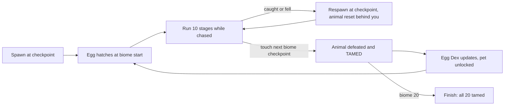

## 1. Vision and Pitch

**{{GAME_NAME}}** (working title). Tagline: *Crack the egg. Beat the biome. Don't get caught.*

**One sentence.** A Roblox difficulty-chart obby where every difficulty tier is its own biome, and every biome starts with an egg that hatches the animal that will chase you through all ten of its stages.

**The pitch.** Players know exactly what a difficulty chart obby is: 200 stages, tiers from Easy to Nil, one checkpoint per stage, bragging rights for how far you got. We keep every one of those expectations and add the thing Roblox is obsessed with right now: eggs and animals. Each of the 20 tiers is a hand-themed biome (a sunny meadow, a rooftop at sunset, a megalodon trench, a dragon's peak) and each biome has one animal, from the 140-model Animal Empire bundle, that hatches from an egg on a pedestal in a five-second cutscene and then runs the obby behind you. A bar across the top of the screen shows the whole biome, your headshot, and a live render of the animal creeping up on you. Reach the next biome's checkpoint and the animal is defeated and **tamed**: it joins your Egg Dex and can follow you as a pet. Twenty eggs, twenty animals, one run.

| | |
|---|---|
| Genre | Obby / platformer with a pursuit layer, single-player progression in a multiplayer server |
| Platform | Roblox: PC, mobile (thumbstick + jump only), tablet, console-friendly |
| Audience | 9-14 core, the difficulty-chart-obby crowd plus the pet and egg crowd; secondary: obby YouTubers |
| Session length | 8-15 minutes casual, 30-60 minutes for a push through a biome |
| Rating | All ages; no blood, no jumpscares, animals are chasers not horrors |
| Team | 3-4 people (design, build, script, art), see section 9 |

**The twist, as told to a 10-year-old.** "It's a difficulty chart obby, but every level is a different world, and at the start of each world there's an egg. It hatches, an animal jumps out, and it chases you the whole world. If it catches you, you go back to your checkpoint and it gets pushed back too. Beat the world and you tame it."

### 1.1 Design pillars

1. **The egg is the hook.** Every biome opens on a hatch. The reveal is the emotional beat, so it gets the camera, the sound, and the tier card. *We will* make the first hatch of each biome mandatory and spectacular. *We will not* let it become tedious: repeats are skippable.
2. **Fair pressure, never cheap deaths.** The animal punishes stalling, not skill. *We will* rubber-band it so a player who keeps moving is never caught from behind. *We will not* let it out-run a clean run, ever; the only way to get caught is to stop.
3. **Difficulty comes from the biome number.** Stage layouts, hazards and animal speed all scale with the tier. *We will* introduce exactly one new mechanic per biome and stack it on the old ones. *We will not* introduce two new ideas in one biome.
4. **Long stages, honest checkpoints.** *We will* make stages 200-430 studs of path with a checkpoint at every stage, so a death costs seconds. *We will not* build blind drops, cheese routes or checkpoint-less gauntlets.
5. **Collect the roster.** The animal that chased you becomes yours. *We will* build the Egg Dex, the tamed-pet follower and seasonal biomes from the leftover animals. *We will not* sell power over other players; skips and coils only ever move you along your own run.

### 1.2 Core loop

### 1.3 What the player experiences

- **Minute 1.** Spawn on Sunny Meadow's first checkpoint. Camera swings to a polka-dot egg; it wobbles, cracks, a Capybara pops out and the card reads BIOME 1 - EASY - SUNNY MEADOW. "RUN!" The bar at the top shows a capybara icon 24 studs behind your face. You jump three stepping stones and look back: it is strolling. Relief, then a grin.
- **Minute 5.** Biome 2, Golden Farm. The Golden Retriever is faster and the hay carts move. You stall on a cart, the dog icon slides toward yours, the bar's animal marker starts pulsing red and a heartbeat fades in. You make it. Checkpoint toast.
- **Minute 30.** Biome 5 or 6. You have tamed four animals; the Egg Dex shows four gold cells. The Kangaroo bounces you around Red Outback on bounce pads; you get caught twice and see the CAUGHT! flash, but every death only costs a few seconds. You look at the Shop once and close it.
- **Hour 5.** Biome 14, Pterosaur Peaks. You know the rhythm: hatch, sprint the first three stages while the animal is frozen, settle into the pace, never stop on a wind platform. A friend joins and you watch their Quetzalcoatlus chase them on their own bar. You are playing for the Egg Dex now, and for biome 20's dragon.

### 1.4 Why now

Market research (September 2026) points the same way from three directions:

- **Eggs and animals are the platform's dominant loop.** Steal An Egg is the number one experience on Roblox; Grow a Garden built its retention on eggs that sit in the world with a visible timer; Adopt Me and Pet Simulator 99 proved players are protective of hatch feel and that a journal of hatched creatures gives completionists a long tail.
- **Chase obbies are a proven, under-produced genre.** Barry's Prison Run, Piggy, Rainbow Friends and Doors show that a named, characterful chaser and a cutscene at every checkpoint turn an obby into a story, and that death is the monetisation moment (revive products). Existing animal-escape obbies (Escape Mad Beasts, Escape Zoo) show real demand with thin production values.
- **Difficulty chart obbies are a known quantity with a community**, wikis and conventions (tier names and colours, one checkpoint per stage, skip-stage products). 200 stages in 20 tiers is squarely inside the norm.

### 1.5 Success metrics (targets to validate in soft launch)

| Metric | Target | Why |
|---|---|---|
| D1 retention | 40% | GameAnalytics 2025 places a well-optimised obby above 40% |
| D7 retention | 15% | Egg Dex and tamed pets should hold a week |
| Average session | 12 min | Two biomes of progress for a mid-skill player |
| Biome 1 completion | 80% of new players | The onboarding biome must not lose people |
| Biome 5 completion | 35% of new players | End of act 1 is the first real wall |
| Payer conversion | 3% | Skip stage and revive at death are the two impulse buys |
| ARPDAU | 25-40 Robux | Consistent with front-page obbies of this size |
| Hatch cutscene skip rate (repeats) | under 60% | If higher the cutscene is too long |
