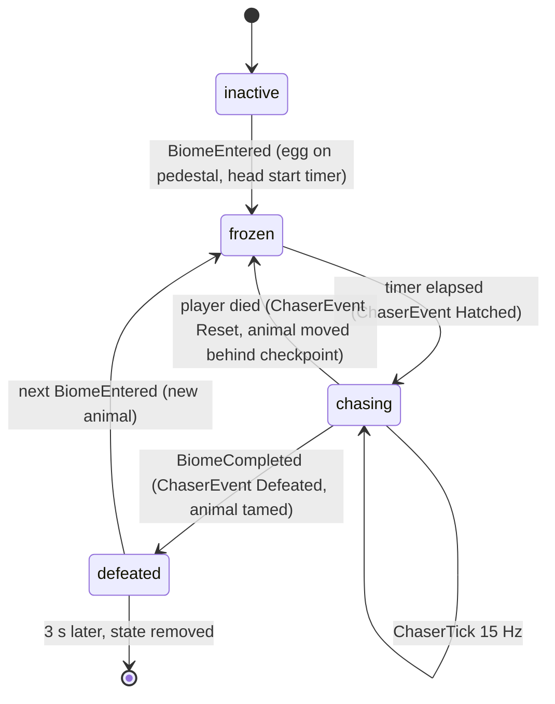

## 2. Core Gameplay and Rules

### 2.1 Movement

Default Roblox movement: walkspeed 16 studs/s, jump power 50, no sprint, no double jump. Mobile plays with the thumbstick and the jump button only; every obstacle in the game must be clearable with those two inputs. Speed Coil (walkspeed 24) and Gravity Coil (jump power 65) are gamepasses that make the player's own run easier and are never required.

### 2.2 Stages and checkpoints

- 200 stages, 10 per biome, 20 biomes. Stage N belongs to biome ceil(N / 10). Stage 201 means finished.
- Every stage starts with a Checkpoint pad in the biome's tier colour with a flag and the stage number floating above it.
- Checkpoints are accepted **strictly in order**: touching checkpoint K only counts when your stage is K - 1. Touching an earlier checkpoint does nothing. This kills every skip exploit that does not involve teleporting.
- Respawn is at your checkpoint, 4 studs up, facing along the path. Respawn time is 1.5 s.
- Falling below the world (200 studs under the lowest biome) or touching any kill part respawns you; deaths are counted on your profile.

### 2.3 The chase, in player terms

An egg sits on a pedestal 24 studs before every biome's first checkpoint. When you enter the biome it hatches, and the animal starts running the same route you do, always behind you, always closing when you stop. The bar at the top of the screen is the whole biome: your headshot and the animal's face move along it, and the number under them is the distance in studs. If the animal reaches you, you die and respawn at your checkpoint; the animal is pushed back behind the checkpoint and frozen for a few seconds so you get a fresh start. Reach the next biome's first checkpoint and the animal is defeated and tamed.

### 2.4 The chase, in exact rules

The animal is a number: **s**, studs travelled along the biome's path (a polyline of waypoints through all ten stages). The player is projected onto the same path every frame: **sp**. Everything else follows:

| Rule | Value |
|---|---|
| Chaser speed each frame | `baseSpeed x profileMultiplier x rubberBand` studs/s (biome values below) |
| Catch | `sp - s <= catchDistance` (3 studs) **and** 3D distance from the animal's path point to the player <= `catchRadius` (6 studs), **or** the along-path condition held for 1.0 s continuously (the player is hiding beside the path) |
| On catch | player health set to 0, CAUGHT! flash, death counted |
| On any death | chaser moves to `checkpointS - resetGap`, freezes for `respawnTime + respawnHeadStart` |
| On hatch | chaser frozen for `cutscene (5.2 s) + headStart`; skipping the cutscene starts the head start immediately |
| Never overshoots | `s` is capped at `sp`; the animal cannot pass you and wait ahead |
| Invulnerable | 3 s after a paid Revive Here: no catch, no kill bricks |
| Tick | the server sends `(s, mode)` to the owning player 15 times a second on an unreliable remote |

**Rubber band (fairness).** Applied to the speed every frame:

- **Catch-up.** If the gap `sp - s` is larger than `maxGap`, speed is multiplied by `catchUpMultiplier`. The animal never falls hopelessly behind; the bar always shows it coming.
- **Mercy.** If the gap is smaller than `mercyGap` **and** the player's smoothed forward progress is at least 4 studs/s, speed becomes `min(speed x mercyMultiplier, playerProgress x 0.9)`. A player who keeps moving is never caught from behind, in any biome.
- **Standing still is always punished.** Idle (moving under 2 studs/s) disables mercy, and the `stalker` profile accelerates the animal the longer you idle.

| Value | Biome 1 | Biome 10 | Biome 20 |
|---|---|---|---|
| baseSpeed | 9 studs/s | 15 | 20 |
| headStart after hatch | 12 s | 9 s | 12 s |
| respawnHeadStart | 4.0 s | 3.3 s | 2.5 s |
| resetGap | 45 studs | 38 | 30 |
| maxGap (catch-up beyond) | 200 studs | 172 | 140 |
| catchUpMultiplier | 1.5x | 1.64x | 1.8x |
| mercyGap (mercy inside) | 30 studs | 24 | 18 |
| mercyMultiplier | 0.80x | 0.85x | 0.90x |
| catchDistance / catchRadius | 3 / 6 | 3 / 6 | 3 / 6 |

{{SPEED_CURVE}}

### 2.5 The seven chase profiles

Each animal has one profile; the profile shapes the speed over time and what the player sees. Profile parameters live in `Biomes.luau`.

| Profile | Feel | Rule | Used by |
|---|---|---|---|
| `steady` | Relentless cruise | multiplier 1 | Capybara, Mammoth |
| `bursty` | Burst and rest | `burstMultiplier` for `burstSeconds`, then `restMultiplier` for `restSeconds` (rest 0.05 = a visible stop: bone sniff, selfie, hide in a bush, tentacle slam) | Golden Retriever, Tanuki, Quokka, Kangaroo, Cerberus, Kraken, Phoenix |
| `stalker` | Idle punisher | 1 + min(idle, idleCap) x idleGain; the longer you stand still, the faster it comes | Cat, Honey Badger, Crocodile |
| `roarer` | Roar then sprint | every `roarEvery` s: stops for `roarSeconds` (telegraph), then `sprintMultiplier` for `sprintSeconds` | Cassowary, Gorilla, Minotaur, Dragon |
| `blinker` | Pounce | cruises at `baseMultiplier`, then teleports `blinkStuds` forward every `blinkPeriod` s with a `telegraphSeconds` warning | Sabre-toothed Tiger |
| `flyer` | Follows the path in the air | multiplier 1; rendered `hoverHeight` above the path with a sine bob | Quetzalcoatlus |
| `swimmer` | Follows the path in the water | multiplier 1; rendered 2 studs below path height with a slow bob | Shark, Megalodon |

Telegraphs are visible: a roaring or about-to-pounce animal pulses with a red highlight, and the bar's animal marker pulses red whenever the gap is under 40 studs, with a heartbeat sound whose volume follows the gap.

### 2.6 Biome transitions, finishing, rejoining

- Touching the next biome's first checkpoint fires **BiomeCompleted** for the old biome (animal plays its defeated fall, TAMED! flash, Egg Dex updates, best time recorded) and **BiomeEntered** for the new one (new egg, new cutscene, new chaser). Both happen in the same frame; the old animal lingers for 3 s.
- Biome 20 ends on a Finish gate after stage 200; touching it sets stage 201, defeats the dragon, awards the Finished badge. The player can keep playing any biome from the Egg Dex (roadmap: teleport to biome).
- Rejoining mid-biome: you spawn at your checkpoint, the biome's egg hatches again (skippable, since you have seen it), and the animal starts one `resetGap` behind your checkpoint instead of at the egg.
- Leaving a biome by any skip product moves the animal with you: the new biome's chaser is created fresh.

### 2.7 Multiplayer rules

- Servers hold 12 players. Every player has their **own** animal; you only ever see your own chaser. Other players are visible and harmless (no collision with you, no PvP), so a server feels alive and friends can race the same biome side by side.
- Roadmap: ghost renders of friends' chasers at low tick rate, and a "spectate a friend's bar" widget.

### 2.8 Death causes

| Cause | What happens |
|---|---|
| Kill part (red neon, tag `KillBrick`) | instant death |
| Fall | destroyed at 200 studs below the lowest biome floor |
| Caught | instant death, CAUGHT! flash, camera shake |
| Reset (Roblox `R`) | same as any death |

### 2.9 Chaser state machine

