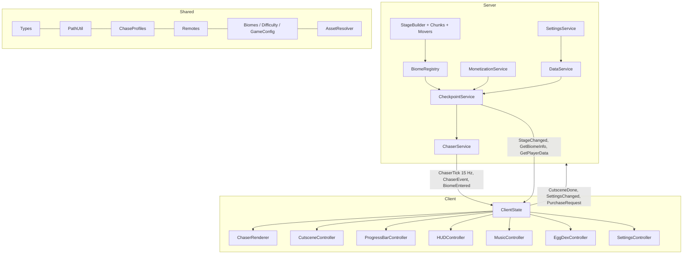

## 8. Technical Design

The engine is implemented in this repository (Rojo project, strict Luau, typechecked with luau-lsp, unit-tested under the standalone luau CLI). This section is the map for whoever maintains it.

### 8.1 Architecture

### 8.2 The chaser is a scalar on a path

Each biome's route is a polyline (`PathUtil.build` from the `Path/WP_nnnn` parts). The chaser's whole state is the distance `s` along it. Every Heartbeat the server:

1. projects the player's HumanoidRootPart onto the path with a hint (`PathUtil.project(path, pos, lastS, 120)`), searching only segments within 120 studs of the last value so folded routes never snap the projection to a parallel leg;
2. updates idle time and a smoothed forward-progress rate;
3. advances `s` by `baseSpeed x ChaseProfiles.multiplier(...) x rubberBand x dt`, plus any `blinkStep`, capped at the player's `sp`;
4. checks the catch conditions and kills the player;
5. every 1/15 s sends `(s, mode)` to the owning player on an `UnreliableRemoteEvent`.

No pathfinding, no physics, no collision for the animal: any rig works, twenty rigs cost nothing, and the client renders the model at `PathUtil.positionAt(path, s)` with a lerp, a locomotion offset (hover for flyers, -2 for swimmers), a lunge toward the real player position inside 7 studs, and run/idle animations.

### 8.3 Level authoring contract and generator

See section 4.5 for the folder contract. `BiomeRegistry.Start` discovers each `Biome_XX`, builds the path, projects the checkpoints, and generates any missing biome with `StageBuilder.BuildBiome`. Chunks are pure builders `(ctx) -> nextCursor`; animated parts register with the `Movers` Heartbeat driver (one connection for every rotating bar, timed beam and crusher in the game). Kill parts are tagged `KillBrick` and get their handler from `StageBuilder.InstallKillBricks`, including hand-built ones added later.

### 8.4 Data safety

- Load with five retries (1, 2, 4, 8, 16 s). On total failure the session is **read-only**: defaults are served, nothing is ever saved, the player is warned in the output.
- Loaded data is deep-merged over defaults so new fields appear for old profiles; stage and deaths are sanitised.
- Save with `UpdateAsync`, dirty flag, autosave every 60 s, on `PlayerRemoving`, and in `BindToClose` (waits up to 25 s live, 3 s in Studio).
- DataStore tables use string keys (`eggsHatched["7"]`).
- Purchases: `ProcessReceipt` checks a `PurchaseLedger_v1` entry keyed by PurchaseId before granting, and writes it after, so a retried receipt never grants twice.

### 8.5 Security

- Stage, chaser position and catches are server-only. The client never sends a stage.
- Every remote argument is type-checked and range-checked (`GetBiomeInfo` index 1-20, settings clamped, purchase kinds whitelisted, equippedPet must be a tamed animal).
- Checkpoints accept only `current + 1`; products are the only way to move further and they go through Roblox receipts.
- Client-side cutscene freezing and camera work are local; the server only shortens the head start when told the cutscene ended, never below 1 s.

### 8.6 Performance budget

| Item | Budget |
|---|---|
| Chaser simulation | one projection + a few multiplications per player per frame; under 0.1 ms for 12 players |
| Chaser replication | 15 messages/s per player, 2 numbers each, unreliable |
| Generated world | about 12k parts and 3-4k waypoint parts across 20 biomes on a 4 x 5 grid; StreamingEnabled keeps clients light |
| Animated parts | one Heartbeat driver; a few hundred CFrame writes per frame server-side |
| Client rendering | one animal model + one ViewportFrame clone; procedural bob when rigs lack animations |
| Touched handlers | one per kill part and checkpoint (about 2.5k connections), idle until touched |

### 8.7 Toolchain

Rojo 7.7 (`default.project.json`), luau-lsp 1.69 strict typecheck with the Roblox definitions (`scripts/check.sh`), StyLua formatting, and a standalone luau CLI unit-test harness for the pure modules (`tests/run.sh`; shims for Vector3, Color3, CFrame and task). Pinned in `rokit.toml`. `scripts/gen_biomes.py` regenerates `Biomes.luau` from `docs/roster.json` + `docs/roster_mapping.json`; `scripts/build_gdd.py` regenerates this document's tables from the same data.

### 8.8 Module map

| Module | Owns |
|---|---|
| Shared/Types | every shared type (BiomeDef, ChaseConfig, PlayerData, PathData, remotes' enums) |
| Shared/Config/GameConfig | stage counts, tick rate, grid, cutscene beats, monetization ids, badge ids, tier colours |
| Shared/Config/Biomes | generated: the 20 BiomeDefs |
| Shared/Config/Difficulty | per-biome scalar curve; mechanic unlock order derived from Biomes |
| Shared/PathUtil | build, positionAt (binary search), project (windowed), clamp, serialize |
| Shared/ChaseProfiles | multiplier, blinkStep, telegraph, verticalOffset for the seven profiles |
| Shared/Signal | typed signal |
| Shared/Remotes | lazy creation on the server, waiting on the client, kinds by name |
| Shared/AssetResolver | animal and egg lookup under Assets, placeholder builders |
| Server/DataService | profiles, retries, autosave, leaderstats |
| Server/MonetizationService | gamepass cache, receipts + ledger, purchase prompts, coil effects |
| Server/StageBuilder, Chunks, Movers | greybox generation, 21 chunk builders, animated-part driver, kill handler |
| Server/BiomeRegistry | biome runtime data, stage/biome arithmetic, ClientBiomeInfo |
| Server/CheckpointService | stage progression, spawns, signals, skips/revive, RemoteFunctions |
| Server/ChaserService | the chase simulation and replication |
| Server/SettingsService | settings validation |
| Client/ClientState | client view of the game + signals |
| Client/ModelPrep, Sfx, UI | model prep and animation lookup, sound helpers, UI builders and panels |
| Client/Controllers/* | ChaserRenderer, CutsceneController, ProgressBarController, HUDController, MusicController, EggDexController, SettingsController |

### 8.9 Remotes

| Remote | Kind | Direction | Payload |
|---|---|---|---|
| BiomeEntered | event | server -> client | biomeIndex, animalName, firstTimeEver |
| ChaserTick | unreliable | server -> client | s, mode |
| ChaserEvent | event | server -> client | kind (Hatched, Caught, Defeated, Reset), biomeIndex, extra |
| StageChanged | event | server -> client | stage, biomeIndex, stageInBiome |
| CutsceneDone | event | client -> server | none |
| SettingsChanged | event | client -> server | partial settings table (validated) |
| RequestSkipStage | event | client -> server | none (prompts the product) |
| PurchaseRequest | event | client -> server | kind ("gamepass" or "product"), key |
| GetBiomeInfo | function | client -> server | biomeIndex -> ClientBiomeInfo |
| GetPlayerData | function | client -> server | none -> PlayerData |
